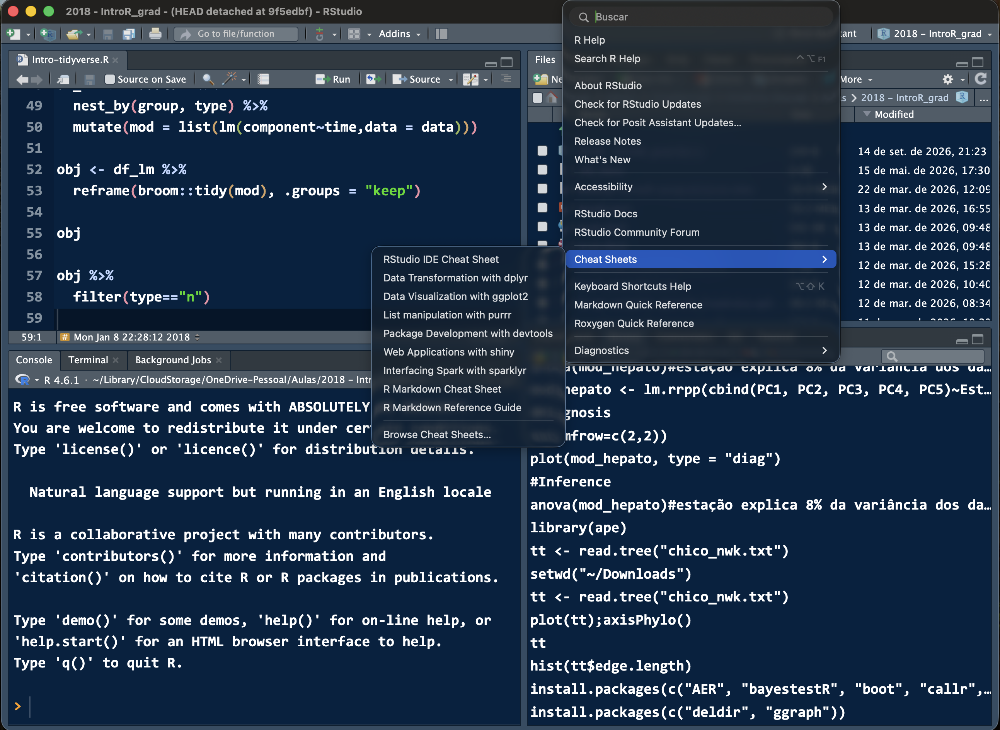
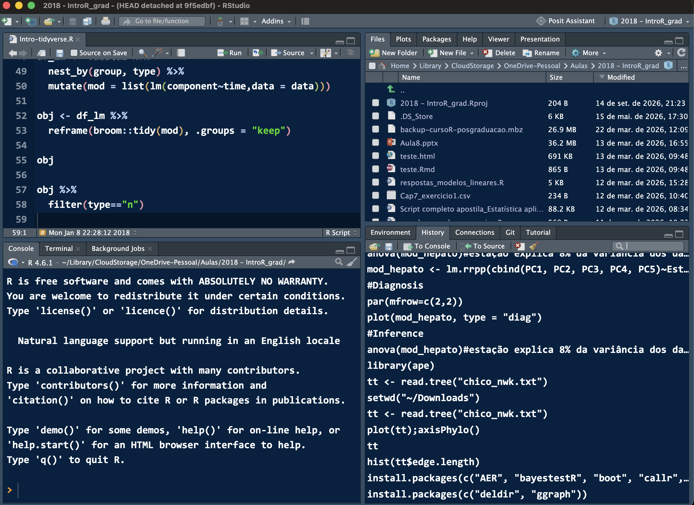
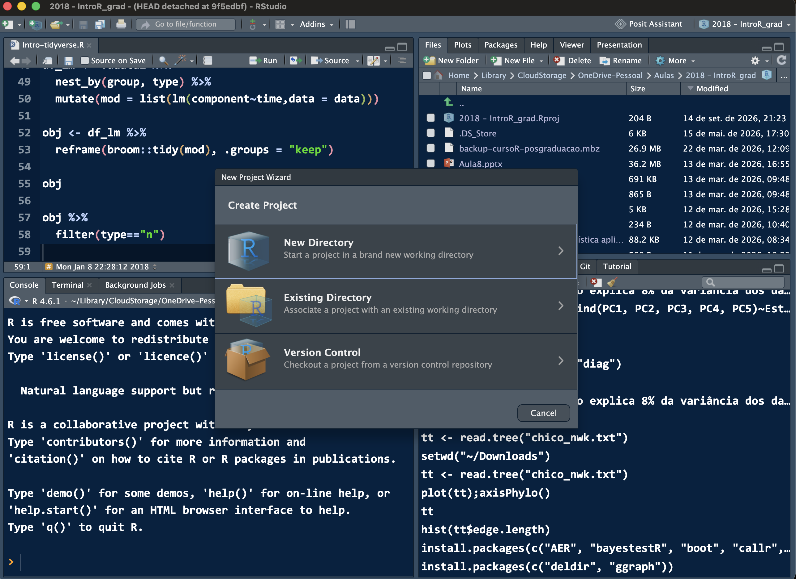
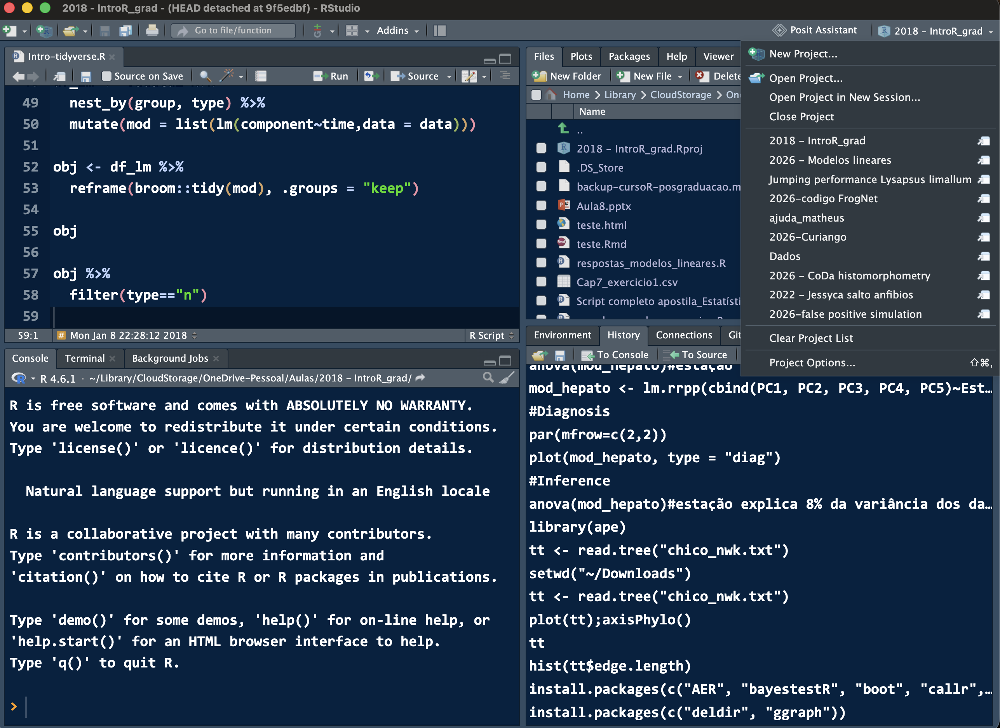

```{r}
#| include: false
options(width = 76)
# Os slides são renderizados a partir de slides/; o aluno roda a partir da
# raiz do Projeto. O caminho mostrado no slide é o dele, não o meu.
dados <- read.csv(here::here("dados", "anuros_altitude.csv"))
```

# A disciplina

## Programa do curso {.smaller}

::: {.incremental}
1. Introdução ao R
2. Organização e curadoria dos dados
3. Importação e manipulação de dados
4. Controle de versão (git e GitHub)
5. Análise — modelos lineares simples
6. Gráficos com `ggplot2`
7. Rudimentos de programação
8. Reprodutibilidade em pesquisa (Markdown e Quarto)
:::

## Avaliação {.smaller}

**Um único trabalho final:** um documento Quarto (ou R Markdown) **compilado
em `.html` ou `.pdf`**, com um fluxo de análise completo seguindo o `tidyverse`.

::: {.incremental}
- importar os dados
- limpar e organizar (*tidy*)
- explorar com gráficos
- ajustar um modelo e diagnosticá-lo
- relatar — texto, código e resultados no mesmo documento
:::

. . .

::: {.citacao}
Não há prova escrita. A nota é **um documento que compila** — se ele roda na
minha máquina a partir do que você entregou, a maior parte do trabalho está
feita.
:::

## E vamos construí-lo a semana inteira {.smaller}

Cada dia acrescenta uma camada ao mesmo trabalho:

| Dia | O que entra no seu documento |
|---|---|
| **Segunda** | o Projeto criado, os dados importados |
| **Terça** | tudo versionado no git; dados limpos com `dplyr` |
| **Quarta** | os gráficos e o modelo |
| **Quinta** | o texto em volta, e o documento compilado |

. . .

::: {.citacao}
Ou seja: na quinta-feira vocês não começam o trabalho — vocês **terminam**
o que vêm fazendo desde hoje de manhã.
:::

## Cronograma — segunda {.smaller}

**Manhã**

- Ambientação no R e no RStudio
- Tipos de objetos
- Como obter ajuda
- Como escrever e organizar um script

**Tarde**

- Organização dos dados no seu computador
- Boas práticas e curadoria de dados

## Cronograma — terça

**Manhã**

- Controle de versão com git e GitHub

**Tarde**

- Manipulação de dados e a estratégia *split-apply-combine*: o `tidyverse`
- *Subsetting*, `summarize()`, `group_by()`, o operador *pipe*

## Cronograma — quarta

**Manhã**

- Análises simples com modelos lineares
- Gráficos com `ggplot2`

**Tarde**

- Exercícios com gráficos
- Análises com `tidyverse` e modelos lineares
- Rudimentos de programação

## Cronograma — quinta e sexta {.smaller}

**Quinta, manhã**

- Reprodutibilidade em pesquisa: Markdown, knitr e Quarto
- Como organizar um documento Quarto

**Quinta, tarde**

- Exercícios com Quarto

**Sexta, manhã**

- Tira-dúvidas

## Onde ficam os materiais {.smaller}

**Este site** — slides, scripts e dados de todas as aulas:

[provetelab.org/intro-r](https://provetelab.org/intro-r/){.r-fit-text}

. . .

**Moodle da UFMS** — quizzes, entregas e avaliações da turma:

[ava.ufms.br](https://ava.ufms.br)

::: {.citacao}
A chave de inscrição do Moodle eu passo em aula.
:::

# Por que programar

## Por que uma linguagem, e não um menu {.smaller}

::: {.incremental}
- **Controle do que se quer fazer** — você conhece todos os passos da análise
- O preço: é preciso **aprender uma linguagem**
- **Gratuito e aberto**, amplamente usado por biólogos — análises novas
  aparecem primeiro em R
:::

. . .

::: {.citacao}
O argumento decisivo aparece na quinta-feira: análise feita clicando em menu
não pode ser auditada nem repetida. O script é a receita.
:::

## O que dizem por aí {.smaller}

> "For students entering my lab, I place a premium on **quantitative skills**,
> intellectual creativity, hard work, and independence."

. . .

> "What kinds of skills do you need for success in community ecology? You
> should invest the time in learning a **programming/statistical language**…
> R is the language that I recommend… there is no better (or more enjoyable)
> way to learn about statistics and ecological theory than by programming."

::: {.citacao}
Nicholas J. Gotelli, University of Vermont —
[Information for Prospective Graduate Students](https://www.uvm.edu/~ngotelli/GradAdvice.html)
:::

# Instalando

## R e RStudio são duas coisas {.smaller}

::: {.incremental}
- **R** é a linguagem e o motor — [r-project.org](https://www.r-project.org)
- **RStudio** é o ambiente de trabalho (IDE) que roda por cima —
  [posit.co/download/rstudio-desktop](https://posit.co/download/rstudio-desktop/)
:::

. . .

Instale **nessa ordem**: primeiro o R, depois o RStudio.

::: {.citacao}
A empresa que faz o RStudio mudou de nome para **Posit** em 2022. Você vai
encontrar os dois nomes na internet — é a mesma coisa.
:::

## Fichas de referência

Resumos de uma ou duas páginas, por pacote. Vale imprimir as do `dplyr` e do
`ggplot2` já na segunda-feira.

[opensource.posit.co/resources/cheatsheets](https://opensource.posit.co/resources/cheatsheets/)

. . .

Há versões em português de algumas delas, feitas pela comunidade.

## Estão dentro do RStudio também {.smaller}

**Help → Cheat Sheets** — as principais já vêm instaladas.

{.nostretch width="88%"}

## Enquanto instala…

Dá para rodar R no navegador, sem instalar nada:

- [jdoodle.com/execute-r-online](https://www.jdoodle.com/execute-r-online)
- [Posit Cloud](https://posit.cloud) — o RStudio inteiro no navegador,
  com conta gratuita

::: {.citacao}
Serve para a primeira hora e para emergências. Não serve para o curso:
a partir de amanhã vocês precisam dos arquivos na própria máquina.
:::

## Onde procurar ajuda depois {.smaller}

::: {.incremental}
- **Manuais e tutoriais** do CRAN —
  [cran.r-project.org/other-docs.html](https://cran.r-project.org/other-docs.html)
- **CRAN Task Views** — como navegar entre 20 mil pacotes por área temática:
  [cran.r-project.org/web/views](https://cran.r-project.org/web/views/)
- **Bioconductor** — pacotes de bioinformática, fora do CRAN
- Listas **R-SIG-XXX** por tema, e a lista brasileira **R-Br**
:::

# O ambiente de trabalho

## Os quatro painéis do RStudio {.smaller}

| Painel | Onde fica | Para que serve |
|---|---|---|
| **Source** | acima, à esquerda | onde você **escreve o script** |
| **Console** | abaixo, à esquerda | onde o R **executa** |
| **Environment** | acima, à direita | os objetos que existem agora |
| **Files / Plots / Help** | abaixo, à direita | arquivos, gráficos, ajuda |

. . .

::: {.citacao}
A regra do curso: **escreva no Source, não no Console.** O console esquece;
o script fica.
:::

## Os quatro painéis, de verdade {.smaller}

O seu vai estar vazio — e claro em vez de escuro, até mexerem em
*Tools → Global Options → Appearance*.

{.nostretch width="88%"}

## Comece pelo Projeto {.smaller}

**File → New Project…** e escolha:

::: {.incremental}
- **New Directory** — projeto novo, pasta nova
- **Existing Directory** — você já tem a pasta
- **Version Control** — clonar um repositório do GitHub (terça-feira)
:::

. . .

::: {.citacao}
Por que isso importa tanto que abre o curso: o Projeto define o diretório de
trabalho sozinho, e o script deixa de depender de onde a pasta está. Voltamos
nisso à tarde, com `here()`.
:::

## A janela que abre {.smaller}

**Version Control** é como vocês vão clonar o repositório da disciplina na terça.

{.nostretch width="88%"}

## Trocando de projeto {.smaller}

O canto superior **direito** mostra o projeto aberto — e lista os outros.
Cada um abre com sessão, histórico e arquivos próprios.

{.nostretch width="88%"}

## Duas facilidades que economizam horas

::: {.incremental}
- **Tab completion** — comece a digitar e aperte `Tab`. Funciona para
  funções, argumentos, nomes de objetos e caminhos de arquivo
- **Snippets** — atalhos que expandem para blocos de código. Digite `fun` e
  `Tab` para o esqueleto de uma função
:::

::: {.citacao}
[Documentação dos snippets](https://docs.posit.co/ide/user/ide/guide/productivity/snippets.html)
:::

# A linguagem

## Seguindo no livro

Esta parte acompanha o capítulo 4 de
[Análises Ecológicas no R](https://analises-ecologicas.com/cap4.html#funcionamento-da-linguagem-r).

::: {.citacao}
Leiam em casa o que não der tempo de ver aqui.
:::

## O R como calculadora

```{r}
2 + 3
2^10
sqrt(144)
5 %% 2      # resto da divisão
5 %/% 2     # divisão inteira
```

. . .

O prompt `>` espera um comando novo. O prompt `+` significa que o R está
esperando você **terminar** o comando anterior — quase sempre um parêntese
ou uma aspa que faltou fechar.

## Atribuir é guardar

```{r}
a <- 1
b <- c(1, 2, 3, 4, 5)
minha.media <- mean(b)
minha.media
```

. . .

::: {.incremental}
- Use `<-`, não `=`. Os dois funcionam, mas `<-` é a convenção e evita
  confusão com os argumentos de função
- Atalho no RStudio: `Alt` + `-` (Windows/Linux) ou `Option` + `-` (Mac)
- O objeto aparece no painel **Environment** assim que é criado
:::

## Tipos de objeto {.smaller .diagrama-menor}

Duas perguntas resolvem: **quantas dimensões?** e **todos os elementos do
mesmo tipo?** Cada cor abaixo é um tipo de dado.

```{dot}
//| echo: false
//| fig-width: 9
digraph estruturas {
  bgcolor="transparent"; rankdir=TB; ranksep=0.30; nodesep=0.55;
  graph [size="9,4.3!"];
  node [shape=plaintext fontname="Helvetica" margin="0.02,0.02"];
  edge [style=invis];

  // Cabeçalhos das colunas e rótulos das linhas.
  h0 [label=""];
  h1 [label=<<FONT POINT-SIZE="20" COLOR="#144f64"><B>Homogêneo</B></FONT>>];
  h2 [label=<<FONT POINT-SIZE="20" COLOR="#144f64"><B>Heterogêneo</B></FONT>>];
  r1 [label=<<FONT POINT-SIZE="18" COLOR="#144f64"><B>1 dimensão</B></FONT>>];
  r2 [label=<<FONT POINT-SIZE="18" COLOR="#144f64"><B>2 dimensões</B></FONT>>];
  r3 [label=<<FONT POINT-SIZE="18" COLOR="#144f64"><B>n dimensões</B></FONT>>];

  // Cada célula da grade é um nó: um desenho de quadradinhos com a legenda
  // embaixo. Uma cor = um tipo de dado, então "tudo azul" quer dizer
  // "todos do mesmo tipo".
  c11 [label=<
    <TABLE BORDER="0" CELLBORDER="0" CELLSPACING="0" CELLPADDING="2"><TR><TD>
      <TABLE BORDER="0" CELLBORDER="1" CELLSPACING="0" CELLPADDING="0" COLOR="#1c6e8c"><TR>
        <TD WIDTH="44" HEIGHT="30" FIXEDSIZE="TRUE" BGCOLOR="#cfe3ea"></TD>
        <TD WIDTH="44" HEIGHT="30" FIXEDSIZE="TRUE" BGCOLOR="#cfe3ea"></TD>
        <TD WIDTH="44" HEIGHT="30" FIXEDSIZE="TRUE" BGCOLOR="#cfe3ea"></TD>
        <TD WIDTH="44" HEIGHT="30" FIXEDSIZE="TRUE" BGCOLOR="#cfe3ea"></TD>
      </TR></TABLE>
    </TD></TR><TR><TD><FONT POINT-SIZE="18" COLOR="#144f64"><B>vetor</B></FONT></TD></TR></TABLE>>];

  c12 [label=<
    <TABLE BORDER="0" CELLBORDER="0" CELLSPACING="0" CELLPADDING="2"><TR><TD>
      <TABLE BORDER="0" CELLBORDER="1" CELLSPACING="0" CELLPADDING="0" COLOR="#1c6e8c"><TR>
        <TD WIDTH="44" HEIGHT="30" FIXEDSIZE="TRUE" BGCOLOR="#cfe3ea"></TD>
        <TD WIDTH="44" HEIGHT="30" FIXEDSIZE="TRUE" BGCOLOR="#f0dfc0"></TD>
        <TD WIDTH="44" HEIGHT="30" FIXEDSIZE="TRUE" BGCOLOR="#d9e7cf"></TD>
        <TD WIDTH="44" HEIGHT="30" FIXEDSIZE="TRUE" BGCOLOR="#ecd6d6"></TD>
      </TR></TABLE>
    </TD></TR><TR><TD><FONT POINT-SIZE="18" COLOR="#144f64"><B>lista</B></FONT></TD></TR></TABLE>>];

  c21 [label=<
    <TABLE BORDER="0" CELLBORDER="0" CELLSPACING="0" CELLPADDING="2"><TR><TD>
      <TABLE BORDER="0" CELLBORDER="1" CELLSPACING="0" CELLPADDING="0" COLOR="#1c6e8c">
        <TR><TD WIDTH="44" HEIGHT="24" FIXEDSIZE="TRUE" BGCOLOR="#cfe3ea"></TD><TD WIDTH="44" HEIGHT="24" FIXEDSIZE="TRUE" BGCOLOR="#cfe3ea"></TD><TD WIDTH="44" HEIGHT="24" FIXEDSIZE="TRUE" BGCOLOR="#cfe3ea"></TD><TD WIDTH="44" HEIGHT="24" FIXEDSIZE="TRUE" BGCOLOR="#cfe3ea"></TD></TR>
        <TR><TD WIDTH="44" HEIGHT="24" FIXEDSIZE="TRUE" BGCOLOR="#cfe3ea"></TD><TD WIDTH="44" HEIGHT="24" FIXEDSIZE="TRUE" BGCOLOR="#cfe3ea"></TD><TD WIDTH="44" HEIGHT="24" FIXEDSIZE="TRUE" BGCOLOR="#cfe3ea"></TD><TD WIDTH="44" HEIGHT="24" FIXEDSIZE="TRUE" BGCOLOR="#cfe3ea"></TD></TR>
        <TR><TD WIDTH="44" HEIGHT="24" FIXEDSIZE="TRUE" BGCOLOR="#cfe3ea"></TD><TD WIDTH="44" HEIGHT="24" FIXEDSIZE="TRUE" BGCOLOR="#cfe3ea"></TD><TD WIDTH="44" HEIGHT="24" FIXEDSIZE="TRUE" BGCOLOR="#cfe3ea"></TD><TD WIDTH="44" HEIGHT="24" FIXEDSIZE="TRUE" BGCOLOR="#cfe3ea"></TD></TR>
      </TABLE>
    </TD></TR><TR><TD><FONT POINT-SIZE="18" COLOR="#144f64"><B>matriz</B></FONT></TD></TR></TABLE>>];

  // No data frame cada COLUNA tem a sua cor: é o ponto todo do formato.
  c22 [label=<
    <TABLE BORDER="0" CELLBORDER="0" CELLSPACING="0" CELLPADDING="2"><TR><TD>
      <TABLE BORDER="0" CELLBORDER="1" CELLSPACING="0" CELLPADDING="0" COLOR="#1c6e8c">
        <TR><TD WIDTH="44" HEIGHT="24" FIXEDSIZE="TRUE" BGCOLOR="#cfe3ea"></TD><TD WIDTH="44" HEIGHT="24" FIXEDSIZE="TRUE" BGCOLOR="#f0dfc0"></TD><TD WIDTH="44" HEIGHT="24" FIXEDSIZE="TRUE" BGCOLOR="#d9e7cf"></TD><TD WIDTH="44" HEIGHT="24" FIXEDSIZE="TRUE" BGCOLOR="#ecd6d6"></TD></TR>
        <TR><TD WIDTH="44" HEIGHT="24" FIXEDSIZE="TRUE" BGCOLOR="#cfe3ea"></TD><TD WIDTH="44" HEIGHT="24" FIXEDSIZE="TRUE" BGCOLOR="#f0dfc0"></TD><TD WIDTH="44" HEIGHT="24" FIXEDSIZE="TRUE" BGCOLOR="#d9e7cf"></TD><TD WIDTH="44" HEIGHT="24" FIXEDSIZE="TRUE" BGCOLOR="#ecd6d6"></TD></TR>
        <TR><TD WIDTH="44" HEIGHT="24" FIXEDSIZE="TRUE" BGCOLOR="#cfe3ea"></TD><TD WIDTH="44" HEIGHT="24" FIXEDSIZE="TRUE" BGCOLOR="#f0dfc0"></TD><TD WIDTH="44" HEIGHT="24" FIXEDSIZE="TRUE" BGCOLOR="#d9e7cf"></TD><TD WIDTH="44" HEIGHT="24" FIXEDSIZE="TRUE" BGCOLOR="#ecd6d6"></TD></TR>
      </TABLE>
    </TD></TR><TR><TD><FONT POINT-SIZE="18" COLOR="#144f64"><B>data frame</B></FONT></TD></TR></TABLE>>];

  // O array são matrizes empilhadas. O empilhamento é fingido com duas grades
  // deslocadas: a primeira linha, de células vazias, fixa a largura da coluna
  // em 12px, e cada grade ocupa 11 dessas colunas (COLSPAN) — daí o degrau.
  c31 [label=<
    <TABLE BORDER="0" CELLBORDER="0" CELLSPACING="0" CELLPADDING="2"><TR><TD>
      <TABLE BORDER="0" CELLBORDER="0" CELLSPACING="0" CELLPADDING="0">
        <TR><TD WIDTH="12" HEIGHT="1" FIXEDSIZE="TRUE"></TD><TD WIDTH="12" HEIGHT="1" FIXEDSIZE="TRUE"></TD><TD WIDTH="12" HEIGHT="1" FIXEDSIZE="TRUE"></TD><TD WIDTH="12" HEIGHT="1" FIXEDSIZE="TRUE"></TD><TD WIDTH="12" HEIGHT="1" FIXEDSIZE="TRUE"></TD><TD WIDTH="12" HEIGHT="1" FIXEDSIZE="TRUE"></TD><TD WIDTH="12" HEIGHT="1" FIXEDSIZE="TRUE"></TD><TD WIDTH="12" HEIGHT="1" FIXEDSIZE="TRUE"></TD><TD WIDTH="12" HEIGHT="1" FIXEDSIZE="TRUE"></TD><TD WIDTH="12" HEIGHT="1" FIXEDSIZE="TRUE"></TD><TD WIDTH="12" HEIGHT="1" FIXEDSIZE="TRUE"></TD><TD WIDTH="12" HEIGHT="1" FIXEDSIZE="TRUE"></TD></TR>
        <TR><TD></TD><TD COLSPAN="11">
          <TABLE BORDER="0" CELLBORDER="1" CELLSPACING="0" CELLPADDING="0" COLOR="#8fbccb">
            <TR><TD WIDTH="44" HEIGHT="22" FIXEDSIZE="TRUE" BGCOLOR="#e7f1f5"></TD><TD WIDTH="44" HEIGHT="22" FIXEDSIZE="TRUE" BGCOLOR="#e7f1f5"></TD><TD WIDTH="44" HEIGHT="22" FIXEDSIZE="TRUE" BGCOLOR="#e7f1f5"></TD></TR>
            <TR><TD WIDTH="44" HEIGHT="22" FIXEDSIZE="TRUE" BGCOLOR="#e7f1f5"></TD><TD WIDTH="44" HEIGHT="22" FIXEDSIZE="TRUE" BGCOLOR="#e7f1f5"></TD><TD WIDTH="44" HEIGHT="22" FIXEDSIZE="TRUE" BGCOLOR="#e7f1f5"></TD></TR>
          </TABLE>
        </TD></TR>
        <TR><TD COLSPAN="11">
          <TABLE BORDER="0" CELLBORDER="1" CELLSPACING="0" CELLPADDING="0" COLOR="#1c6e8c">
            <TR><TD WIDTH="44" HEIGHT="22" FIXEDSIZE="TRUE" BGCOLOR="#cfe3ea"></TD><TD WIDTH="44" HEIGHT="22" FIXEDSIZE="TRUE" BGCOLOR="#cfe3ea"></TD><TD WIDTH="44" HEIGHT="22" FIXEDSIZE="TRUE" BGCOLOR="#cfe3ea"></TD></TR>
            <TR><TD WIDTH="44" HEIGHT="22" FIXEDSIZE="TRUE" BGCOLOR="#cfe3ea"></TD><TD WIDTH="44" HEIGHT="22" FIXEDSIZE="TRUE" BGCOLOR="#cfe3ea"></TD><TD WIDTH="44" HEIGHT="22" FIXEDSIZE="TRUE" BGCOLOR="#cfe3ea"></TD></TR>
          </TABLE>
        </TD><TD></TD></TR>
      </TABLE>
    </TD></TR><TR><TD><FONT POINT-SIZE="18" COLOR="#144f64"><B>array</B></FONT></TD></TR></TABLE>>];

  c32 [label=<<FONT POINT-SIZE="18" COLOR="#566470">—</FONT>>];

  // Arestas invisíveis só para alinhar a grade — linhas e depois colunas.
  {rank=same; h0; h1; h2;}   h0 -> h1 -> h2;
  {rank=same; r1; c11; c12;} r1 -> c11 -> c12;
  {rank=same; r2; c21; c22;} r2 -> c21 -> c22;
  {rank=same; r3; c31; c32;} r3 -> c31 -> c32;
  h0 -> r1 -> r2 -> r3;
  h1 -> c11 -> c21 -> c31;
  h2 -> c12 -> c22 -> c32;
}
```

::: {.citacao}
O **data frame** é o formato dos seus dados de campo: uma coluna de cada tipo.
:::

## Os tipos dentro de um vetor {.smaller}

```{dot}
//| echo: false
//| fig-width: 9
digraph vetores {
  bgcolor="transparent"; rankdir=TB; ranksep=0.3; nodesep=0.3;
  graph [size="9,4.2!"];
  node [shape=box style="rounded,filled" fillcolor="#f3eee3" color="#1c6e8c"
        fontname="Helvetica" fontsize=20 margin="0.22,0.12"];
  edge [color="#8a8375" arrowhead=none];

  V   [label="Vetor" shape=ellipse fillcolor="#e3dccd"];
  AT  [label="Vetor atômico\ntodos do mesmo tipo"];
  LI  [label="Lista\npode misturar tipos"];
  LOG [label="logical\nTRUE / FALSE"];
  NUM [label="numeric"];
  CHR [label="character\n\"texto\""];
  INT [label="integer\n1L"];
  DBL [label="double\n1.5"];

  V -> AT; V -> LI;
  AT -> LOG; AT -> NUM; AT -> CHR;
  NUM -> INT; NUM -> DBL;
}
```

::: {.citacao}
Estrutura adaptada de [Advanced R](https://adv-r.hadley.nz/vectors-chap.html),
de Hadley Wickham.
:::

## Coerção: o R nunca reclama

Um vetor atômico só guarda **um** tipo. Se você misturar, o R converte tudo
para o tipo mais permissivo — **em silêncio**.

```{r}
c(1, 2, "três")      # viraram texto!
c(TRUE, FALSE, 1)    # viraram número
```

. . .

::: {.citacao}
É por isso que uma planilha com `"sem dados"` no meio de uma coluna numérica
transforma a coluna inteira em texto. Guardem isso para a aula da tarde.
:::

## O arquivo de ajuda

```r
?mean            # ajuda de uma função que você sabe o nome
help(mean)       # o mesmo
??regression     # procura por assunto
```

**O que ler, em ordem de utilidade:**

::: {.incremental}
1. **Usage** — a assinatura da função e os valores padrão
2. **Arguments** — o que cada argumento faz
3. **Examples**, no fim — quase sempre a parte mais útil
:::

## Quando a ajuda não basta

- [rseek.org](https://rseek.org) — busca restrita ao universo R
- [Stack Overflow](https://stackoverflow.com/questions/tagged/r) — dúvidas de código
- [Cross Validated](https://stats.stackexchange.com) — dúvidas de estatística

::: {.citacao}
Na sexta-feira falamos de como usar LLMs para isso — e do que conferir
antes de acreditar na resposta.
:::

## Instalando e carregando pacotes

```r
install.packages("tidyverse")   # uma vez só, na vida da máquina
library(dplyr)                  # toda vez que abrir o R
library(ggplot2)
```

. . .

::: {.incremental}
- `install.packages()` **baixa**; `library()` **carrega**
- `install.packages()` nunca vai dentro de um script que você compartilha —
  ele mexe na máquina de quem rodar
- Pacotes vão **todos no começo** do script
:::

# Entrando e saindo

# O dado da semana

## Um arquivo, oito aulas {.smaller}

::: {.citacao}
Bovo, R.P.; Simon, M.N.; **Provete, D.B.**; Lyra, M.; Navas, C.A.;
Andrade, D.V. (2023). **Beyond Janzen's Hypothesis: How Amphibians That
Climb Tropical Mountains Respond to Climate Variation.**
*Integrative Organismal Biology* 5(1): obad009.
[doi:10.1093/iob/obad009](https://doi.org/10.1093/iob/obad009)
:::

. . .

**225 indivíduos**, 5 espécies de anuros, 6 altitudes, 2 serras da Mata
Atlântica. Limites térmicos, perda de água, massa e clima de cada sítio.

::: {.citacao}
Dados reais, publicados, com os problemas que dados reais têm. É o mesmo
arquivo de hoje até sexta-feira.
:::

## Monte a pasta agora {.arvore}

```
intro-r/
├── intro-r.Rproj
├── dados/
│   ├── anuros_altitude.csv     <- baixe da página da aula
│   └── processados/            <- o que o seu script produzir
├── scripts/
│   └── aula-01.R
└── figuras/
```

. . .

::: {.citacao}
Tudo o que vem depois supõe essa estrutura. Cinco minutos agora economizam
a semana inteira.
:::

## Importando dados

```{r}
#| eval: false
dados <- read.csv("dados/anuros_altitude.csv")
```

. . .

Existe também `read.csv(file.choose())`, que abre uma janela para você
escolher o arquivo. **Evitem.**

::: {.citacao}
Um caminho escrito no script roda de novo sozinho. Uma janela exige que
alguém esteja ali para clicar — e ninguém sabe o que foi clicado da última vez.
:::

## Conferindo o que entrou {.smaller}

Antes de qualquer análise, sempre estes quatro:

```r
head(dados)      # as primeiras linhas
str(dados)       # a estrutura: tipo de cada coluna
dim(dados)       # quantas linhas e colunas
summary(dados)   # resumo por coluna
```

. . .

```{r}
dim(dados)
names(dados)[1:10]
```

## O que o `str()` mostra

```{r}
str(dados[, 1:8])
```

. . .

::: {.citacao}
O `str()` é o mais importante: é onde você descobre que a coluna que deveria
ser numérica entrou como texto. Repare em `ID` e `Sex`: `chr`, texto — e
está certo. Já `EWL_Ugcm2s1` ser `num` é o que a gente queria ver.
:::

## Agora vocês

::: {.callout-note icon=false}
## 5 minutos — no **Source**, não no Console

1. Crie o Projeto e a pasta `dados/`; ponha o `anuros_altitude.csv` lá
2. Leia o arquivo num objeto chamado `dados`
3. Rode os quatro: `head()`, `str()`, `dim()`, `summary()`
4. **Escreva no script, em comentário, uma coisa que você notou** e que
   não estava neste slide
:::

. . .

::: {.citacao}
O passo 4 é o que importa. Quem só roda os quatro comandos não viu nada —
viu a tela. Vou pedir a resposta de três de vocês.
:::

## O que o `summary()` mostra

```{r}
summary(dados[, c("Bodymass_g", "CTmin", "CTmax")])
```

. . .

::: {.incremental}
- A massa vai de **0,4 g a 373 g** — três ordens de grandeza numa amostra só
- `CTmax` tem **35 `NA`**. `CTmin` tem 1
:::

. . .

::: {.citacao}
Nenhum erro, nenhum aviso. Se vocês não tivessem olhado, descobririam esses
35 ausentes só na quarta-feira, quando um modelo disser `n = 190`.
:::

## Exportando

```r
write.csv(objeto, "dados/processados/anuros_limpo.csv", row.names = FALSE)
```

. . .

::: {.incremental}
- Escreva em `.csv` ou `.txt` — formatos abertos
- `row.names = FALSE` evita aquela primeira coluna de números sem nome
- O que sai do script vai para `dados/processados/`, nunca por cima do bruto
:::

## Quais funções você aprendeu hoje?

Anote, com uma frase cada, o que faz cada função nova desta manhã:

```r
c()   mean()   sqrt()   head()   str()   dim()   summary()   names()
library()   install.packages()   read.csv()   write.csv()   ?
```

::: {.citacao}
Esse caderninho vale mais que o slide. E na sexta-feira ele vira o seu
próprio resumo da disciplina.
:::
