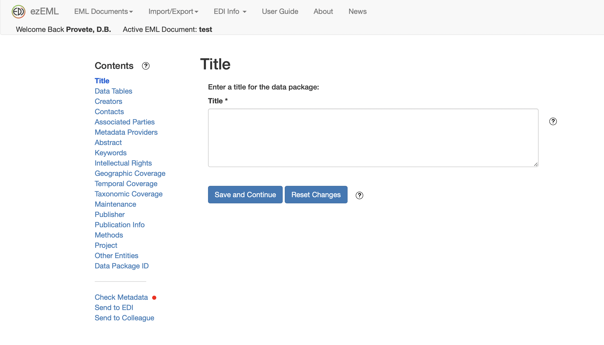

```{r}
#| include: false
options(width = 76)
dados <- read.csv(here::here("dados", "anuros_altitude.csv"))
```

## Roteiro

::: {.incremental}
- Como nomear arquivos
- Como organizar uma planilha de dados
- Diretórios de trabalho e Projetos do RStudio
- Metadados e publicação dos dados
- Como escrever e organizar um script
:::

# Nomear arquivos

## Melhores práticas para nomear arquivos

::: {.incremental}
- Faça algo **descritível**
- Não seja **genérico**
- Faça algo que tenha um **tamanho razoável**
- Seja **consistente**
:::

::: {.citacao}
Adaptado de slides de Rebekah Cummings
:::

## Quem arquivou melhor? {.smaller}

. . .

```
MyData.xlsx
```

Genérico demais — daqui a seis meses, quais dados são esses?

. . .

```
publiclibrarypartnershipsprojectevaluationdataworkshop22014CummingsHelenaMontana.xlsx
```

Descritivo, mas ilegível.

. . .

```
PLPP_EvaluationData_Workshop2_2014.xlsx
```

Descritivo **e** de tamanho razoável.

::: {.citacao}
Adaptado de slides de Rebekah Cummings
:::

## Regras de nomenclatura {.smaller}

::: {.incremental}
- Use apenas **letras, números e sublinhados**
- Sem caracteres especiais: `% @ # * ? !`
- **Sem espaços**
- Minúsculas, ou intercale minúsculas e maiúsculas (`LikeThis`)
- Nem todo sistema é *case sensitive*: assuma que `isso`, `ISSO` e `iSsO`
  são a mesma coisa
:::

::: {.citacao}
Adaptado de slides de Rebekah Cummings
:::

## Datas e numeração {.smaller}

**1. Comece com zeros para ganhar escala**

```
001   002   009   019   999
```

**2. Se usar datas, use o formato `AAAAMMDD`**

| Escrito assim | Veredito |
|---------------|----------|
| `June2015`    | ruim |
| `06-18-2015`  | ruim |
| `20150618`    | ótimo |
| `2015-06-18`  | também serve |

::: {.citacao}
Adaptado de slides de Rebekah Cummings · o formato de data é a norma ISO 8601
:::

## Quem arquivou melhor? {.smaller}

. . .

```
July 24 2014_SoilSamples%_v6
```

Espaços, caractere especial, versão manual.

. . .

```
SoilSamples_FINAL
```

"FINAL" nunca é final.

. . .

```
20140724_NSF_SoilSamples_Cummings
```

Data ordenável, projeto, conteúdo, responsável.

::: {.citacao}
Adaptado de slides de Rebekah Cummings
:::

# Curadoria de dados

## De onde vem esse roteiro

::: {.citacao}
Gotelli, N.J. & Ellison, A.M. **Princípios de Estatística em Ecologia.**
Porto Alegre: Artmed. Capítulo 8 — *Gerenciamento e curadoria de dados*.
:::

O fluxograma a seguir é uma adaptação da Figura 8.7 desse capítulo.

## O ciclo, primeira metade {.smaller}

```{dot}
//| echo: false
//| fig-width: 10
digraph c1 {
  rankdir=LR; bgcolor="transparent"; ranksep=0.75; nodesep=0.3;
  node [shape=box style="rounded,filled" fillcolor="#f3eee3" color="#1c6e8c"
        fontname="Helvetica" fontsize=22 margin="0.24,0.14"];
  edge [color="#8a8375" fontname="Helvetica" fontsize=18];

  RAW  [label="Dados brutos\ncaderno de campo,\ninstrumentos"];
  MET  [label="Métodos\ndetalhados"];
  PLAN [label="Organize\nem planilhas"];
  MD0  [label="Gere os\nmetadados"];
  DS   [label="Conjunto de dados\ndocumentado" shape=ellipse fillcolor="#e3dccd"];
  ARQ  [label="Deposite em\nrepositório com DOI"];

  RAW -> PLAN; MET -> MD0; PLAN -> DS; MD0 -> DS; DS -> ARQ;
}
```

::: {.citacao}
Repare que os **metadados** nascem junto com os dados, não no fim.
:::

## O ciclo, segunda metade {.smaller}

```{dot}
//| echo: false
//| fig-width: 10
digraph c2 {
  rankdir=LR; bgcolor="transparent"; ranksep=0.75; nodesep=0.3;
  node [shape=box style="rounded,filled" fillcolor="#f3eee3" color="#1c6e8c"
        fontname="Helvetica" fontsize=22 margin="0.24,0.14"];
  edge [color="#8a8375" fontname="Helvetica" fontsize=18];

  ARQ  [label="Conjunto\narquivado" shape=ellipse fillcolor="#e3dccd"];
  CHK  [label="Conferido?" shape=diamond fillcolor="#ffffff"];
  QC   [label="Marque os discrepantes\ne documente a checagem"];
  AED  [label="Análise\nexploratória"];
  TR   [label="Transformar?" shape=diamond fillcolor="#ffffff"];
  TRA  [label="Transforme e\ndocumente"];
  AN   [label="Analise\nos dados" shape=ellipse fillcolor="#e3dccd"];

  ARQ -> CHK;
  CHK -> QC  [label="não"];
  CHK -> AED [label="sim"];
  AED -> TR;
  TR  -> TRA [label="sim"];
  TR  -> AN  [label="não"];
  QC  -> ARQ [label="volta ao conjunto" constraint=false];
  TRA -> ARQ [label="volta ao conjunto" constraint=false];
}
```

::: {.citacao}
Adaptado de Gotelli & Ellison, Figura 8.7 — com **uma atualização**: onde o
livro diz "mídia permanente (papel, CD-ROM)", hoje se lê **repositório
público com DOI**. Voltamos nesse ponto no fim da aula.
:::

<!-- TODO: no pptx original esse fluxograma reaparecia nos slides 11, 16 e 21
     como marcador de "voce esta aqui". Para recriar, duplique o bloco dot e
     troque o fillcolor do no da vez, p.ex.:  AED [fillcolor="#c2701c"];  -->

## Primeiros passos {.smaller}

Passar as informações do caderno de campo, do relatório de equipamentos etc.
para o computador.

**Organização de planilhas**

::: {.incremental}
- Cada **observação** numa linha — unidade amostral, ou pseudorréplica
- Cada **variável** numa coluna
- Cada **célula** um único valor
:::

. . .

Essas três regras têm nome: **dados organizados** (*tidy data*). É o formato
que o `tidyverse` inteiro pressupõe — guarde o termo, ele volta na aula 04.

::: {.citacao}
Wickham, H. (2014). **Tidy Data.** *Journal of Statistical Software* 59(10).
[doi:10.18637/jss.v059.i10](https://doi.org/10.18637/jss.v059.i10)
:::

## Primeiros passos {.smaller}

::: {.incremental}
- Sempre mantenha **cópias extras** em fontes diferentes: outro computador,
  ou armazenamento em nuvem
- Dados faltantes? Use `NA` (*Not Available*)
- Evite espaços; use `_` para separar palavras
- Assim que terminar de planilhar, **confira novamente** e contraste com a
  fonte original (p. ex., o caderno de campo)
:::

## O que nunca fazer {.smaller}

::: {.incremental}
- **NUNCA** faça gráficos junto com a planilha de dados
- Evite usar mais de uma aba do Excel (ou de qualquer programa de planilhas)
- Salve de preferência em `.txt` ou `.csv` — ou outro formato aberto.
  Evite `.xls`: quem for abrir precisa ter o Excel instalado
:::

## Nomes e pastas {.smaller}

| | |
|---|---|
| `Planilha de espécies.xls` | ✗ |
| `20180108-Composicao_especies_cerradinho_UFMS.txt` | ✓ |

::: {.incremental}
- Separe os arquivos em **pastas para cada projeto**
- Se possível, comece a usar **controle de versão** logo no início do projeto
  (é o assunto da próxima aula)
:::

## Exercício — o que há de errado aqui? {.smaller}

Em dupla, abram a planilha e **listem tudo o que está errado**, usando os
critérios desta aula. Quinze minutos.

[Baixar: `Planilha de dados FINAL v2 (1).xlsx`](../aula-02-curadoria-dados/Planilha%20de%20dados%20FINAL%20v2%20%281%29.xlsx)

. . .

Comecem pelo **nome do arquivo** — vocês já sabem contar pelo menos três
erros antes de abrir.

::: {.citacao}
Dados fictícios, inventados para o exercício.
:::

::: {.notes}
GABARITO — o que a planilha esconde, por bloco da aula.

Nome do arquivo: espaços; parênteses; "FINAL" seguido de "v2" e "(1)";
versionamento manual; nada indica projeto nem data.

Estrutura da aba: título mesclado em A1 por cima dos dados; mais duas
linhas de pseudo-cabeçalho; cabeçalho real só na linha 5; segunda linha
de cabeçalho com as unidades (linha 6) — o R lê isso como dado; linhas
em branco separando blocos; linha TOTAL misturada aos dados; fórmula
=SUM() dentro da coluna de dados.

Nomes de coluna: espaços ("Ponto de coleta"); caracteres especiais
(N°, !, %, °C); unidade dentro do nome em vez de linha de metadados;
"massa%" não é porcentagem nenhuma.

Tipos: datas em cinco formatos diferentes (data real do Excel,
12/03/2019, 12-mar, 2019.03.12, 13-mar-19); números gravados como texto
("12,5", " 14.2" com espaço à frente); unidade dentro da célula
("15,0 mm").

Faltantes: seis convenções diferentes — célula vazia, "-", "n/a", "NA",
"sem dados", "?", ".". Só NA (ou vazio) serve.

Categorias: Cerradinho / cerradinho / "Cerradinho " / CERRADINHO;
Cerradão / Cerradao; Mata de galeria / mata de galeria / Mata de Galeria.
Sexo em seis codificações: M, F, m, f, macho, fêmea, 1, 2, ?.

Espécies: Dendropsophus minutus / D. minutus / "Dendropsophus  minutus"
(espaço duplo) / Dendrops. minutus. E Boana albopunctata convivendo com
Hypsiboas albopunctatus — sinônimo antigo, mesma espécie, duas linhas.

Linha duplicada: a observação de Mata de galeria 14/03 aparece duas vezes,
idêntica.

Informação fora dos dados: comentário de célula em C12; nota solta em L3
("conferir com o caderno"); aba "notas" com informação de método que
deveria estar em metadados — e uma senha, que não deveria estar em
lugar nenhum.

Cor: duas linhas destacadas em amarelo, sem legenda. O R não lê cor.
Se a cor significa algo, vira coluna.

Abas: quatro, sendo uma só de gráfico, uma de notas e uma vazia esquecida.
Gráfico embutido na própria aba de dados.

Formato: .xlsx em vez de .csv.

Fecha perguntando: quantos desses erros o R avisaria? Quase nenhum —
ele leria tudo como texto e seguiria em frente.
:::

## A referência canônica desta aula {.smaller}

::: {.citacao}
Broman, K.W. & Woo, K.H. (2018). **Data Organization in Spreadsheets.**
*The American Statistician* 72(1): 2–10.
[doi:10.1080/00031305.2017.1375989](https://doi.org/10.1080/00031305.2017.1375989)
:::

Doze páginas, acesso aberto, e cobre praticamente tudo o que vimos até aqui.
Tem [site companheiro](https://kbroman.org/dataorg/) com os exemplos.

# Diretórios de trabalho

## O caminho absoluto quebra {.smaller}

```r
setwd("C:/Users/diogo/Documents/tese/cap2/dados")
dados <- read.csv("anuros_altitude.csv")
```

. . .

E o roteiro suplementar do artigo do Bovo — dado real, publicado — abre assim:

```r
setwd("your_path")
```

::: {.citacao}
Ou seja: não roda em lugar nenhum sem edição manual. Acontece com todo mundo.
:::

. . .

Funciona na **sua** máquina, hoje.

Falha na máquina do orientador, na do revisor, no computador do laboratório,
e na sua daqui a dois anos quando você reorganizar as pastas.

::: {.citacao}
É o erro nº 1 em scripts compartilhados. E é o mais fácil de evitar.
:::

## O que um Projeto do RStudio resolve {.smaller}

Um arquivo `.Rproj` na raiz da pasta do projeto. Ao abrir o projeto:

::: {.incremental}
- o **diretório de trabalho já vem definido** — nenhum `setwd()` no script
- cada projeto ganha **sessão própria** do R, com seu histórico e suas abas
- todo caminho passa a ser **relativo à raiz do projeto**
:::

. . .

O script deixa de depender de onde a pasta está no computador.

## Uma estrutura que funciona {.smaller}

```
intro-r/
├── intro-r.Rproj
├── README.md
├── dados/
│   ├── anuros_altitude.csv              <- somente leitura, nunca editar
│   ├── metadados_anuros_altitude.md     <- o que cada coluna significa
│   └── processados/                     <- gerados pelo script, descartáveis
├── scripts/
│   ├── aula-01.R
│   ├── aula-04.R
│   └── aula-06.R
├── figuras/
└── relatorio.qmd
```

. . .

Os números nos scripts dizem a ordem de execução. `dados/brutos/` nunca é
tocado à mão — tudo que muda, muda por script.

## `here::here()` {.smaller}

Mesmo dentro de um Projeto, o diretório de trabalho **muda** quando você
renderiza um Quarto que está numa subpasta.

```r
library(here)

here()
#> "/Users/diogo/GitHub/intro-r"

dados <- read.csv(here("dados", "anuros_altitude.csv"))
```

. . .

`here()` sempre devolve a raiz do projeto, **de onde quer que você chame**.
Funciona no script, no Quarto e na máquina de quem clonar o repositório.

# Metadados

## Metadados

Armazene **num arquivo separado**, na mesma pasta dos dados, os métodos que
você usou para obtê-los.

::: {.incremental}
- Data de coleta
- Coletor
- Modelo e marca do equipamento
- Unidades de medida de cada variável
:::

## O nosso, por exemplo {.smaller}

`dados/metadados_anuros_altitude.md` — um arquivo de texto, versionável:

```
## Fonte
Bovo, R.P.; Simon, M.N.; Provete, D.B.; ... (2023). Beyond Janzen's
Hypothesis... doi:10.1093/iob/obad009

## Variáveis
| Coluna        | Unidade        | O que é                          |
|---------------|----------------|----------------------------------|
| EWL_Ugcm2s1   | µg H2O/cm²·s   | taxa de perda de água evaporativa|
| CTmax         | °C             | limite térmico crítico superior  |
| Tbr           | °C             | DERIVADA: CTmax - CTmin          |
| BIO_5         | °C             | temp. máxima do mês mais quente  |
```

::: {.citacao}
Markdown, não Word. Cabe no git, o diff é legível, e daqui a três anos ele
ainda abre. **A unidade que vocês tirarem do nome da coluna tem que aparecer
aqui** — senão não foi movida, foi perdida.
:::

## Coluna derivada é uma armadilha {.smaller}

`Tbr` e `WT` já vêm prontas no arquivo. Confira em vez de confiar:

```{r}
all.equal(dados$Tbr, dados$CTmax - dados$CTmin)
all.equal(dados$WT,  dados$CTmax - dados$BIO_5)
```

. . .

::: {.citacao}
Batem. A segunda difere na quinta casa — arredondamento de quem gravou o
arquivo, não discordância. **Use `all.equal()`, não `==`**: `==` compara bit
a bit e diz `FALSE` por uma diferença na décima quinta casa decimal.
:::

## Um padrão para metadados ecológicos {.smaller}

**EML** — *Ecological Metadata Language* — é o padrão usado pela rede LTER e
pelo repositório da EDI.

**ezEML** é um editor online em formulário que gera EML sem que você precise
escrever XML:

::: {.incremental}
- funciona como um assistente, passo a passo
- checa o documento quanto a correção e completude
- lê a tabela de dados e infere boa parte das características dela
- exporta o EML pronto, ou envia direto para o repositório da EDI
:::

::: {.citacao}
[ezEML](https://ezeml.edirepository.org/eml/) ·
[EML](https://eml.ecoinformatics.org/) ·
[Environmental Data Initiative](https://edirepository.org/)
:::

## ezEML na prática



## Publicando os dados num repositório {.smaller}

::: {.citacao}
Vanderbilt, K.; Ide, J.; Gries, C.; Grossman-Clarke, S.; Hanson, P.;
O'Brien, M.; Servilla, M.; Smith, C.; Waide, R.; Zollo-Venecek, K. (2022).
**Publishing Ecological Data in a Repository: An Easy Workflow for Everyone.**
*The Bulletin of the Ecological Society of America*.
[doi:10.1002/bes2.2018](https://doi.org/10.1002/bes2.2018)
:::

Artigo de acesso aberto que descreve o caminho completo, do arquivo bruto ao
DOI do conjunto de dados.

# Análise exploratória

## Análise exploratória de dados {.smaller}

Importe os dados e **visualize os dados crus** para verificar discrepâncias.

Plote usando o gráfico mais adequado ao tipo de dado:

::: {.incremental}
- *Scatter plot* — duas variáveis contínuas
- *Boxplot* — um tratamento (preditora) e uma resposta contínua
- Um **histograma** nunca é demais
:::

## Primeiro, conte os ausentes {.smaller}

```{r}
colSums(is.na(dados))[c("Sex", "EWL_Ugcm2s1", "CTmin", "CTmax", "BIO_5")]
```

. . .

::: {.incremental}
- **107 sem sexo**, de 225. Não é erro: nem sempre dá para sexar o animal
- **35 sem CTmax.** Esses 35 somem de qualquer modelo que use CTmax
- **`BIO_5` não tem nenhum.** Repare por quê no próximo slide
:::

## Uma variável de sítio, repetida por indivíduo {.smaller}

```{r}
aggregate(BIO_5 ~ Altitude_m, dados, function(x) c(n = length(x), dp = sd(x)))
```

. . .

::: {.citacao}
**Desvio-padrão zero em toda altitude.** `BIO_5` não foi medida em cada
animal — é o clima do *sítio*, copiado para as 39 linhas daquele sítio. São
**6** valores independentes disfarçados de 225.
:::

## Por que isso importa {.smaller}

::: {.incremental}
- O arquivo está **certo**: formato tidy quer uma linha por indivíduo
- O erro seria **tratar as 225 linhas como 225 observações de clima**
- Quem comparar clima entre sítios com *n* = 225 está inventando 219 graus
  de liberdade que não existem
:::

. . .

::: {.citacao}
Não dá para ver no `summary()` nem no `str()` — só contando. É o tipo de
coisa que as *Ten Simple Rules for Digital Data Storage* tratam:
Hart, E.M.; Barmby, P.; LeBauer, D.; Michonneau, F.; Mount, S.; Mulrooney, P.;
Poisot, T.; Woo, K.H.; Zimmerman, N.B.; Hollister, J.W. (2016).
*PLOS Computational Biology* 12(10): e1005097.
[doi:10.1371/journal.pcbi.1005097](https://doi.org/10.1371/journal.pcbi.1005097)
:::

## Documente as alterações

Faça e documente **qualquer** alteração nos dados usando o script.

Evite mexer diretamente na planilha.

::: {.citacao}
Se a alteração está no script, ela é reproduzível e reversível.
Se está na planilha, ela é invisível.
:::

# Organizando o script

## Guias de estilo {.smaller}

- [NiceR Code](https://nicercode.github.io/guide.html)
- [Google R style guide](https://google.github.io/styleguide/Rguide.html)
- [Tidyverse style guide](https://style.tidyverse.org)

::: {.citacao}
Qualquer um serve. O que não serve é não ter nenhum.
:::

## Melhores práticas em um script {.smaller}

::: {.incremental}
- Comece com a **data** e o **título do projeto**
- **Carregue os pacotes** que vai usar, todos no começo
- **Comente** as linhas dizendo *por que* está fazendo aquilo
- **Separe** os elementos da linha de código com espaços
- Use `<-` para atribuir, e não `=`
- **Quebre a linha** se ela ficar muito longa
- Evite dar a objetos nomes que já existem
:::

## Melhores práticas em um script {.smaller}

::: {.incremental}
- Escreva `TRUE` e `FALSE`, não `T` e `F`
- Separe o código em **tópicos/partes**
:::

<!-- TODO: se quiser, mostre aqui um script de exemplo com o cabecalho
     comentado e as secoes separadas por  # ---- nome da secao ----
     que o RStudio transforma em sumario navegavel. -->

## Para levar para o resto da semana {.smaller}

Nada disto se aprende ouvindo. A partir de amanhã, **na prática**:

::: {.incremental}
- Todo código do curso roda dentro de um **Projeto do RStudio**
- Nenhum `setwd()` em script nenhum — use `here()`
- Os arquivos que vocês criarem seguem as regras de nome da aula de hoje
- Se encontrarem na própria planilha algum erro da lista do exercício,
  me contem: é o melhor exemplo possível
:::

. . .

E anotem, com uma frase cada, o que faz cada função nova de hoje —
`setwd()`, `here()`, `read.csv()`. Esse caderninho vale mais que o slide.
