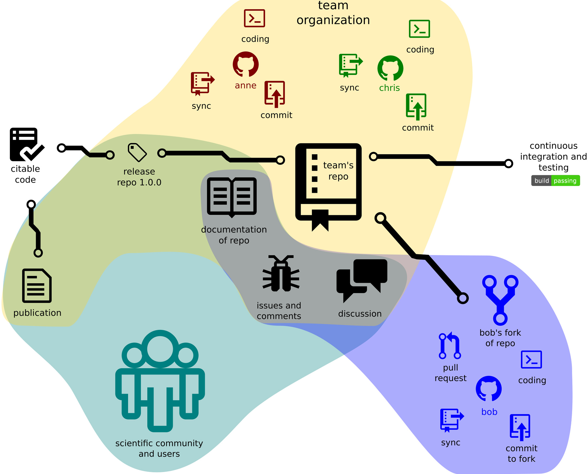
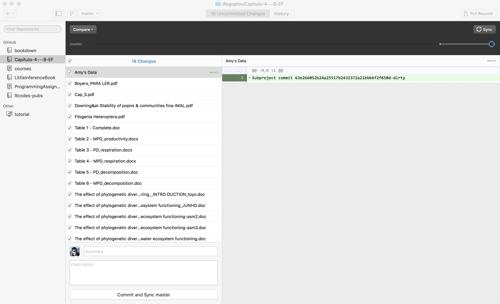
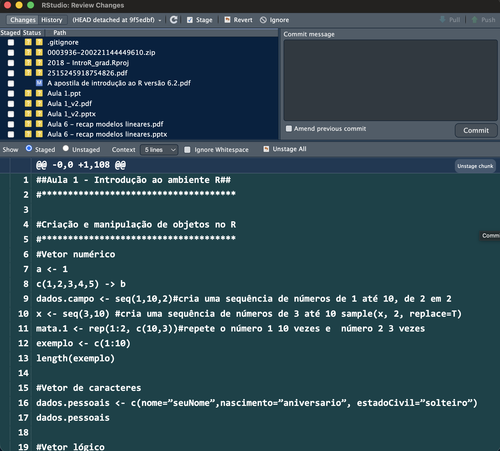

## Para quê controle de versão? {.smaller}

::: {.incremental}
- Ter controle das alterações feitas em um arquivo
- Evitar ter vários arquivos para cada alteração
- Ter visão temporal do desenvolvimento de um projeto — "voltar no tempo"
- Compartilhar com colegas e registrar as alterações que eles fizerem
:::

## O problema, ilustrado

Todo mundo já viveu o ciclo do `FINAL_rev.22.comments49.doc`.

[PHD Comics — "notFinal.doc"](https://phdcomics.com/comics/archive.php?comicid=1531)

::: {.citacao}
Jorge Cham, PHD Comics · tira nº 1531
:::

## Por que isso importa na ciência {.smaller}

::: {.citacao}
Perez-Riverol, Y.; Gatto, L.; Wang, R.; Sachsenberg, T.; Uszkoreit, J.;
da Veiga Leprevost, F.; Fufezan, C.; Ternent, T.; Eglen, S.J.; Katz, D.S.;
Pollard, T.J.; Konovalov, A.; Flight, R.M.; Blin, K.; Vizcaíno, J.A. (2016).
**Ten Simple Rules for Taking Advantage of Git and GitHub.**
*PLOS Computational Biology* 12(7): e1004947.
[doi:10.1371/journal.pcbi.1004947](https://doi.org/10.1371/journal.pcbi.1004947)
:::

## Como um projeto científico se organiza no GitHub



::: {.citacao}
Figura de Perez-Riverol et al. (2016), *PLOS Comp Biol* · CC BY
:::

<!-- TODO: o slide 8 do pptx original trazia um arquivo EMF (1,3 MB),
     formato do Windows que navegador nenhum exibe. Nao consegui
     visualiza-lo para decidir o destino. Se for importante, exporte-o
     como PNG do PowerPoint e me diga o que e. -->

## Aonde está implementado?

- **Git** — o sistema de controle de versão em si
- **GitHub** — o site que hospeda repositórios git
- Alguns armazenamentos em nuvem, **em parte**: Dropbox, Box

::: {.citacao}
Nuvem sincroniza arquivos; git versiona *alterações*. Não são a mesma coisa.
:::

## Na prática



## Qual o fluxo de trabalho?

```{dot}
//| fig-width: 9
digraph fluxo {
  rankdir=LR; bgcolor="transparent"; ranksep=0.5; nodesep=0.22;
  node [shape=box style="rounded,filled" fillcolor="#f3eee3" color="#1c6e8c"
        fontname="Helvetica" fontsize=22 margin="0.24,0.14"];
  edge [color="#8a8375" fontname="Helvetica" fontsize=18];

  WD [label="Working\ndirectory"];
  ST [label="Stage"];
  LR [label="Local\nrepository"];
  RR [label="Remote\nrepository"];

  WD -> ST [label="add"];
  ST -> LR [label="commit"];
  LR -> RR [label="push"];
  RR -> LR [label="fetch"];
  RR -> WD [label="pull"];
  LR -> WD [label="checkout"];
}
```

## O mesmo fluxo, em comandos {.smaller}

1. **Obter um repositório** — `git init` ou `git clone`
2. **Fazer alterações** nos arquivos
3. **Preparar as alterações** — `git add`
4. **Registrar no repositório local** — `git commit -m "minha mensagem"`
5. **Enviar para o remoto** — `git push`

## Comandos essenciais {.smaller}

**O que você vai digitar o tempo todo**

- `git status` — o que mudou, o que está preparado, o que falta. **Na dúvida,
  rode este.** É o comando que responde "onde eu estou?"
- `git add` · `git commit` · `git push` — o ciclo da aula

**Obter e criar projetos**

- `git init` — cria um repositório vazio, ou reinicializa um existente
- `git clone` — clona um repositório para um novo diretório

**Configuração, uma vez só na vida**

- `git config` — define seu nome e e-mail nos commits
- `git help` — a ajuda do git

# O painel Git do RStudio

## Você provavelmente nunca vai abrir o terminal {.smaller}

Ao abrir um Projeto do RStudio que **é** um repositório git, aparece uma aba
**Git** no painel superior direito, junto de *Environment* e *History*.

Tudo o que vimos em comando tem um botão ali:

| No terminal | No painel |
|---|---|
| `git status` | a própria lista de arquivos, sempre visível |
| `git add` | a caixinha **Staged** de cada arquivo |
| `git commit` | botão **Commit** |
| `git push` | seta **↑ Push** |
| `git pull` | seta **↓ Pull** |
| `git diff` | botão **Diff** |

## O painel {.smaller}


## As letrinhas ao lado do arquivo {.smaller}

::: {.incremental}
- **?** amarelo — arquivo novo, o git ainda não sabe que ele existe
- **A** verde — novo e já preparado (*staged*)
- **M** azul — modificado
- **D** vermelho — apagado
- **R** — renomeado
:::

. . .

Dois quadradinhos por linha: o da **esquerda** é o que já está preparado, o da
**direita** é o que mudou e ainda não foi preparado. É `git status` desenhado.

## O ciclo, no painel {.smaller}

1. Salve o arquivo normalmente
2. Marque **Staged** nos arquivos que entram neste commit
3. **Commit** → escreva a mensagem → confirme
4. **↓ Pull** antes de **↑ Push**, sempre

. . .

::: {.citacao}
Puxar antes de empurrar evita a maior parte dos conflitos. Ganhe o hábito
agora, antes de trabalhar com alguém.
:::

## A janela de commit {.smaller}



## Leia o diff antes de commitar {.smaller}

A metade de baixo daquela janela é o `git diff`. Vale o hábito de **passar o
olho nela antes de clicar em Commit**:

::: {.incremental}
- pega aquele `print()` de teste que ficou para trás
- pega a linha que você apagou sem querer
- e obriga você a escrever uma mensagem que descreve algo real
:::

. . .

::: {.citacao}
Mensagem de commit boa completa a frase "este commit vai…":
*"…corrigir a leitura de datas na planilha de campo"*. Não *"ajustes"*.
:::

# Duas coisas que ninguém avisa

## O que NÃO colocar no git {.smaller}

Git foi feito para **texto**: código, `.qmd`, `.csv`, `.md`. Ele guarda cada
versão de cada arquivo, para sempre.

::: {.incremental}
- Arquivos **gerados** pelo código: `.html`, figuras, PDFs de saída
- Dados **grandes** ou binários: `.xlsx`, `.RData`, rasters
- Coisa da sua máquina: `.Rhistory`, `.Rproj.user`, `.DS_Store`
- **Nunca** senhas, chaves de API, dados sensíveis
:::

. . .

O arquivo `.gitignore`, na raiz do repositório, lista o que o git deve fingir
que não existe:

```
.Rproj.user
.Rhistory
.DS_Store
/docs/
dados/processados/
```

## Volte ao painel de agora há pouco {.smaller}

Naquele screenshot, **tudo** estava marcado com **?** — arquivo novo, que o
git ainda não rastreia. E o que era?

::: {.incremental}
- `Aula2.pptx`, `Aula3.pptx`, … — binários pesados que o git não sabe comparar
- `Aula2.pdf`, `Aula5.pdf`, … — **gerados** a partir dos .pptx
- `0003936-200221144449610.zip` — um zip solto
- `.Rproj.user`, `.Rhistory` — configuração da máquina
:::

. . .

::: {.citacao}
É exatamente esse o momento de escrever o `.gitignore` — **antes** do primeiro
`git add .`. Depois, o peso já entrou na história.
:::

## Uma história real {.smaller}

O repositório do site do laboratório rastreava a pasta `docs/` inteira —
**217 MB** de HTML e PDF que o Quarto regenera a cada `render`.

::: {.incremental}
- Cada `render` reescrevia centenas de arquivos → commits gigantes
- O `git push` passou a demorar minutos
- Apagar a pasta **não resolve**: o git guarda o histórico. Os 217 MB
  continuam lá, em cada `clone`
:::

. . .

::: {.citacao}
Um `.gitignore` de cinco linhas, escrito no primeiro dia, teria evitado tudo.
Escrever depois só impede que **piore**.
:::

## Conflito de merge {.smaller}

Acontece quando você e outra pessoa alteram **a mesma linha** do mesmo
arquivo. O git não escolhe por você — ele marca o arquivo assim:

```
<<<<<<< HEAD
media <- mean(dados$crc, na.rm = TRUE)
=======
media <- mean(dados$crc)
>>>>>>> colega
```

. . .

**O que fazer:** abra o arquivo, apague as três linhas de marcação e deixe só
o código que deve ficar — que pode ser uma versão, a outra, ou uma mistura.
Depois `add` e `commit` normalmente.

::: {.citacao}
Não é erro, não quebrou nada, e não precisa de ajuda para resolver.
O pânico é opcional.
:::

## Onde aprender mais

[git-scm.com](https://git-scm.com){.r-fit-text}

A documentação oficial, incluindo o livro *Pro Git* completo e gratuito.

## Exercitando {.smaller}

No [Curso de R intermediário — IPEA](https://ipeadata-lab.github.io/curso_r_intermediario_202501/git-github.html#introdução):

- Leiam do **tópico 5.1 ao 5.5** e façam os exercícios **5.3.1, 5.4.1 e 5.5.2**
- Leiam os **tópicos 5.7 e 5.8** e façam os exercícios **5.7.6 e 5.8.6**
  ([conectar com o RStudio](https://ipeadata-lab.github.io/curso_r_intermediario_202501/git-github.html#conectar-com-o-rstudio))
