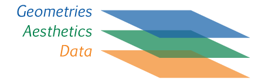
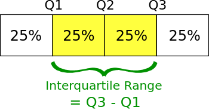
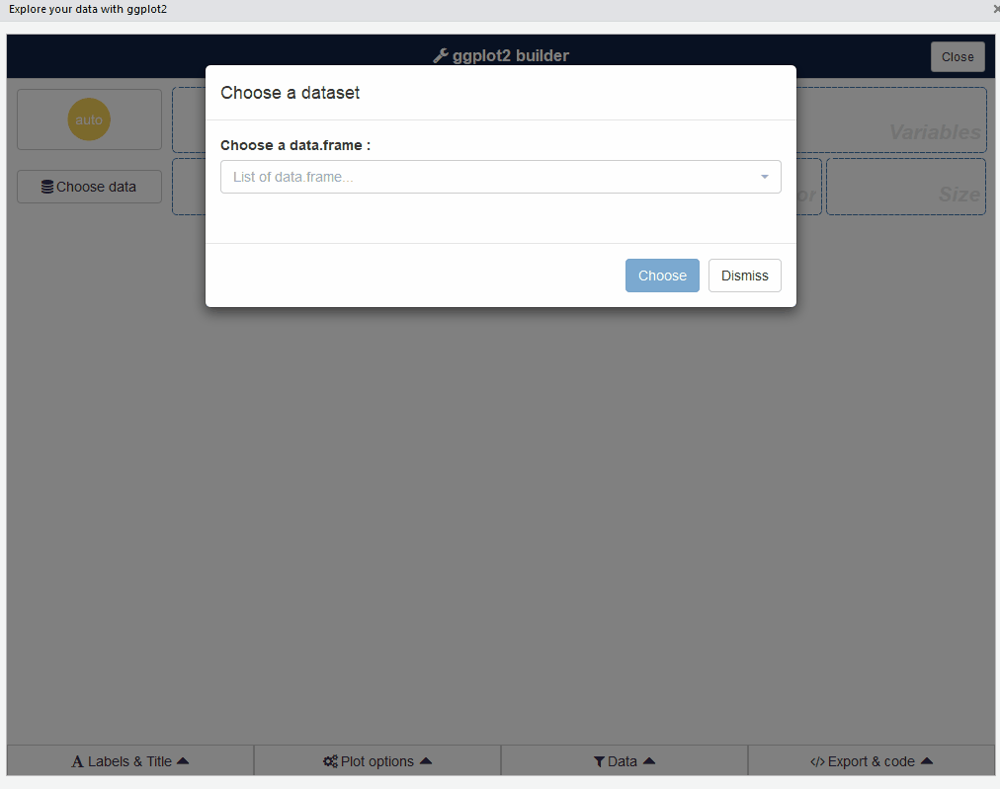
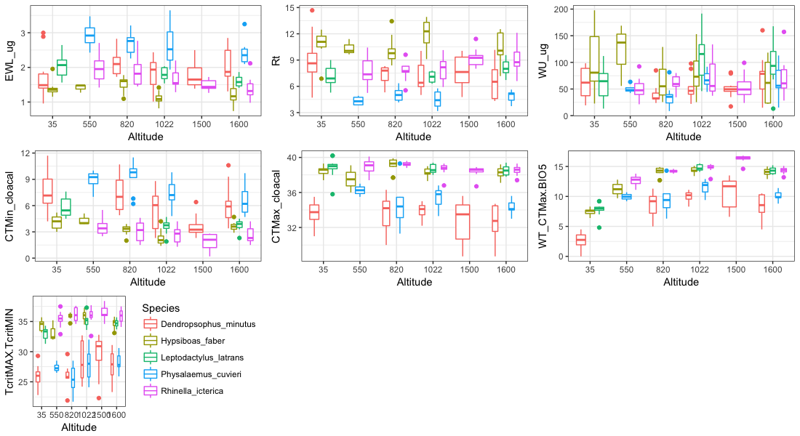
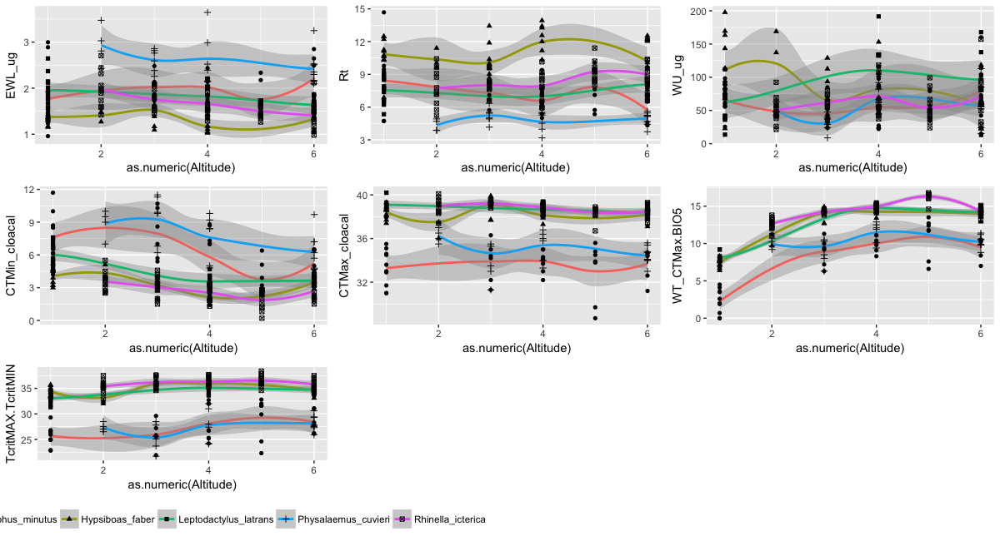
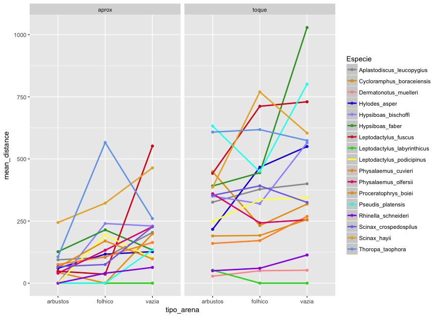
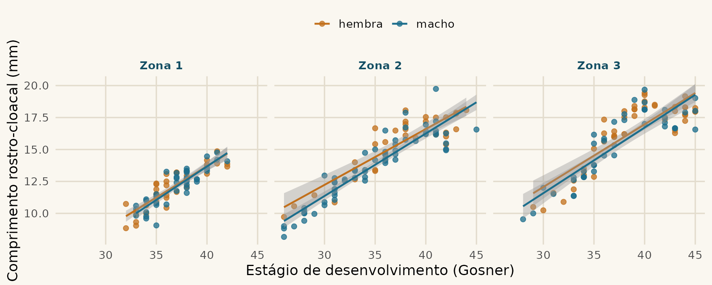
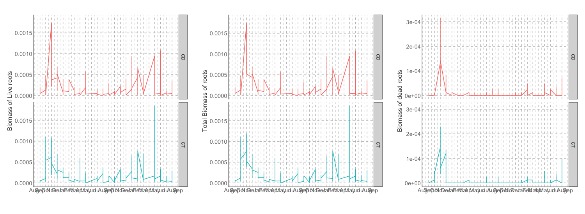

```{r}
#| include: false
library(ggplot2)
library(dplyr)
theme_set(theme_minimal(base_size = 15))
options(width = 74)

anuros <- read.csv(here::here("dados", "anuros_altitude.csv")) %>%
  rename(especie = Species, sexo = Sex, ewl = EWL_Ugcm2s1,
         massa = Bodymass_g, ctmin = CTmin, ctmax = CTmax,
         serra = Mountain_Range, altitude = Altitude_m) %>%
  select(id = ID, especie, sexo, serra, altitude, massa, ewl,
         ctmin, ctmax, bio5 = BIO_5) %>%
  mutate(especie   = factor(especie),
         serra     = factor(serra),
         alt_fator = factor(altitude, levels = sort(unique(altitude))),
         amplitude = ctmax - ctmin,
         tol_aquec = ctmax - bio5)
```

## De onde vem a ideia {.smaller}

::: {.citacao}
Wilkinson, L. (2005). **The Grammar of Graphics.** 2ª ed. Springer.
[doi:10.1007/0-387-28695-0](https://doi.org/10.1007/0-387-28695-0)
:::

::: {.citacao}
Wickham, H. (2010). **A Layered Grammar of Graphics.**
*Journal of Computational and Graphical Statistics* 19(1): 3–28.
[doi:10.1198/jcgs.2009.07098](https://doi.org/10.1198/jcgs.2009.07098)
:::

. . .

A tese dos dois: um gráfico não é um **tipo** que você escolhe de um menu.
É uma **frase** que você monta com peças que se combinam.

::: {.citacao}
É por isso que o `ggplot2` não tem uma função `grafico_de_barras()`.
:::

## Onde aprender mais {.smaller}

- [R for Data Science](https://r4ds.hadley.nz) — capítulos de visualização
- [ggplot2: Elegant Graphics for Data Analysis](https://ggplot2-book.org) — o livro do pacote
- [Análises Ecológicas no R](https://analises-ecologicas.com/cap6.html) — capítulo 6, em português

::: {.citacao}
Boa parte desta aula é adaptada do curso de
[Gustavo Paterno](https://paternogbc.github.io/disciplina-graficos-r/).
:::

# As três camadas

## O que é um gráfico {.smaller}



::: {.incremental}
- **Data** — a tabela
- **Aesthetics** — o *mapeamento*: qual coluna vira qual propriedade visual
- **Geometries** — a *representação*: que forma desenha cada observação
:::

::: {.citacao}
Figura do curso de [Gustavo Paterno](https://paternogbc.github.io/disciplina-graficos-r/)
:::

## Os dados do exemplo {.smaller}

O mesmo arquivo da aula 04, já limpo:

```{r}
#| echo: false
head(anuros[, c("especie", "serra", "altitude", "massa", "ctmin", "ctmax")], 5)
```

::: {.citacao}
Bovo et al. (2023), *Integrative Organismal Biology* ·
[doi:10.1093/iob/obad009](https://doi.org/10.1093/iob/obad009) ·
225 indivíduos, 5 espécies, 6 altitudes
:::

## Duas variáveis contínuas {.smaller}

::: {.incremental}
1. **Dados** — `anuros`
2. **Mapeamento** — `x = ctmin`, `y = ctmax`
3. **Geometria** — `point`
4. **Gráfico** — um ponto por indivíduo
:::

. . .

```{r}
#| output-location: column
#| fig-width: 5
#| fig-height: 4
ggplot(anuros,
       aes(x = ctmin, y = ctmax)) +
  geom_point()
```

## Uma variável contínua {.smaller}

::: {.incremental}
1. **Dados** — os mesmos
2. **Mapeamento** — `x = ctmax`. **Só isso.**
3. **Geometria** — `histogram`
4. **Gráfico** — o eixo Y aparece sozinho: é a **contagem**
:::

. . .

```{r}
#| output-location: column
#| fig-width: 5
#| fig-height: 4
ggplot(anuros, aes(x = ctmax)) +
  geom_histogram(bins = 25)
```

::: {.citacao}
Repare: você não pediu o eixo Y. A geometria calculou.
:::

# A tradução para o R

## Cada camada é um pedaço do comando {.smaller}

| Camada | No R |
|---|---|
| **Dados** | objeto da classe `data.frame` |
| **Mapeamento** | colunas do `data.frame` — X, Y, grupos, cor, preenchimento |
| **Geometria** | uma função da família `geom_` |

. . .

```r
ggplot(data, aes(x, y)) + geom_point()
```

- `data` — define o objeto com a tabela
- `aes()` — define qual coluna é X e qual é Y
- `geom_` — define qual geometria plotar

## O sinal de `+` {.smaller}

```r
ggplot(data, aes(x, y)) +
  geom_point() +
  theme_classic() +
  labs(x = "Gravidade alta", y = "Total")
```

. . .

O `+` **adiciona camadas**. Uma camada por linha, sempre — facilita ler,
facilita comentar uma linha para testar, e facilita achar o erro.

::: {.citacao}
Erro clássico: pôr o `+` no começo da linha seguinte em vez do fim da
anterior. O R não entende — ele precisa saber que a frase continua.
:::

# Mapeamento

## Mapear é traduzir coluna em propriedade visual {.smaller}

Três colunas do nosso arquivo, e o que cada uma pode virar:

| Coluna | Tipo | Vira bem |
|---|---|---|
| `ctmin`, `ctmax` | numérica contínua | posição em X ou Y, gradiente de cor |
| `especie`, `serra` | categórica | cor, forma, faceta |
| `altitude` | numérica com 6 valores | **as duas coisas** — você escolhe |

::: {.citacao}
Essa última linha é a decisão mais interessante do dia. Voltamos a ela.
:::

## O mesmo gráfico, mapeamentos diferentes {.smaller}

```{r}
#| output-location: column
#| fig-width: 5
#| fig-height: 3.4
ggplot(anuros,
       aes(x = ctmin, y = ctmax)) +
  geom_point()
```

. . .

```{r}
#| output-location: column
#| fig-width: 5
#| fig-height: 3.4
ggplot(anuros,
       aes(x = ctmin, y = ctmax,
           colour = especie)) +
  geom_point()
```

## Mais um mapeamento {.smaller}

```{r}
#| output-location: column
#| fig-width: 5.4
#| fig-height: 4
ggplot(anuros,
       aes(x = ctmin, y = ctmax,
           colour = especie,
           shape  = serra)) +
  geom_point(size = 2.4)
```

. . .

::: {.citacao}
Os dados não mudaram. Só o que você pediu para o gráfico dizer sobre eles.
:::

## Dentro ou fora do `aes()`? {.smaller}

```r
geom_point(aes(colour = especie))   # cor VEM DOS DADOS
geom_point(colour = "red")          # cor é uma DECISÃO SUA
```

. . .

::: {.incremental}
- Dentro do `aes()` → o valor da cor depende da linha. Ganha legenda.
- Fora do `aes()` → todos os pontos ficam iguais. Sem legenda.
:::

. . .

::: {.citacao}
É o erro nº 1 de quem está começando. Legenda estranha? Confira se algo
que deveria estar fora do `aes()` foi parar dentro.
:::

## Discretas vs. contínuas {.smaller}

::: {.incremental}
- O ggplot trata qualquer variável **categórica** como **discreta**
- Variáveis de texto costumam virar **fatores** no R
- Fatores são discretos: mapeados por **níveis**, não de forma contínua
:::

. . .

A altitude é o caso perfeito: um **número** que na prática são **seis sítios**.

```{r}
#| output-location: column
#| fig-width: 5
#| fig-height: 3.2
ggplot(anuros,
       aes(ctmin, ctmax,
           colour = altitude)) +
  geom_point()          # gradiente
```

. . .

```{r}
#| output-location: column
#| fig-width: 5
#| fig-height: 3.2
ggplot(anuros,
       aes(ctmin, ctmax,
           colour = alt_fator)) +
  geom_point()          # níveis
```

::: {.citacao}
`factor()` é o interruptor entre os dois mundos. Qual dos dois está certo
**depende da pergunta** — nenhum dos dois é o padrão correto.
:::

# Os cinco gráficos básicos

## Qual gráfico usar? {.smaller}

```{dot}
//| echo: false
//| fig-width: 11
digraph escolha {
  rankdir=LR; bgcolor="transparent"; ranksep=0.6; nodesep=0.22;
  node [shape=box style="rounded,filled" fillcolor="#f3eee3" color="#1c6e8c"
        fontname="Helvetica" fontsize=22 margin="0.24,0.14"];
  edge [color="#8a8375" fontname="Helvetica" fontsize=18];

  VIZ  [label="Visualização\nde dados" shape=ellipse fillcolor="#e3dccd"];
  UMA  [label="Uma variável"];
  DUAS [label="Duas variáveis"];
  HIST [label="Histograma"]; BAR  [label="Barras"];
  DISP [label="Dispersão"];  LIN  [label="Linha"];
  BOX  [label="Boxplot"];
  BARF [label="Barras\nfacet / stack / dodge"];

  VIZ -> UMA; VIZ -> DUAS;
  UMA  -> HIST [label="contínua"];
  UMA  -> BAR  [label="categórica"];
  DUAS -> DISP [label="X num, Y num\nvários Y por X"];
  DUAS -> LIN  [label="X num, Y num\num Y por X"];
  DUAS -> BOX  [label="X categ, Y num"];
  DUAS -> BARF [label="X categ, Y categ"];
}
```

::: {.citacao}
Adaptado do curso de [Gustavo Paterno](https://paternogbc.github.io/disciplina-graficos-r/)
:::

## Histograma — `geom_histogram()` {.smaller}

Representa a **distribuição** de uma variável numérica.

```{r}
#| output-location: column
#| fig-width: 5
#| fig-height: 3.6
ggplot(anuros, aes(x = massa)) +
  geom_histogram(bins = 30)
```

::: {.citacao}
Uma variável numérica. O eixo Y é contagem, calculada pela geometria.
A cauda longa à direita é a *Rhinella icterica*, muito maior que as outras.
:::

## Barras — `geom_bar()` {.smaller}

Representa variáveis **categóricas** com barras de comprimento proporcional
ao valor.

```{r}
#| output-location: column
#| fig-width: 5.4
#| fig-height: 3.6
ggplot(anuros, aes(y = especie)) +
  geom_bar()
```

::: {.citacao}
Uma variável categórica. `geom_bar()` **conta**; `geom_col()` usa um valor
que você já tem. Mapear em `y` em vez de `x` resolve nome comprido sem
precisar girar rótulo.
:::

## Boxplot — `geom_boxplot()` {.smaller}

Quartis de uma variável numérica em função de uma variável categórica.

```{r}
#| output-location: column
#| fig-width: 5
#| fig-height: 3.6
ggplot(anuros,
       aes(x = alt_fator, y = ctmax)) +
  geom_boxplot() +
  labs(x = "Altitude (m)")
```

## Anatomia do boxplot {.smaller}

{width=42%}

::: {.incremental}
- A linha do meio é a **mediana**, não a média
- A caixa vai do 1º ao 3º quartil — **50% dos dados**
- As hastes vão até 1,5 × IQR; o que passa disso vira ponto
:::

## Dispersão — `geom_point()` {.smaller}

A relação entre **duas variáveis numéricas**.

```{r}
#| output-location: column
#| fig-width: 5
#| fig-height: 3.4
ggplot(anuros,
       aes(x = massa, y = ewl)) +
  geom_point(alpha = .6)
```

::: {.citacao}
Massa contra perda de água. Quase tudo empilhado à esquerda: a massa vai de
**0,4 g a 373 g** — três ordens de grandeza na mesma escala linear.
:::

## O mesmo dado, outra escala {.smaller}

```{r}
#| output-location: column
#| fig-width: 5
#| fig-height: 3.4
ggplot(anuros,
       aes(x = massa, y = ewl)) +
  geom_point(alpha = .6) +
  scale_x_log10()
```

. . .

::: {.citacao}
A **escala** é uma camada da gramática, como a geometria. Nenhum dado mudou;
o gráfico passou a ser legível. E o padrão que aparece é real: os anuros
menores perdem **mais** água por área — maior superfície por unidade de
volume.
:::

## Linha — `geom_line()` {.smaller}

Dados em série, conectados por segmentos de reta.

Precisamos de **um** Y por X — então primeiro resumimos:

```{r}
#| output-location: column
#| fig-width: 5
#| fig-height: 3.2
anuros %>%
  group_by(altitude) %>%
  summarise(bio5 = unique(bio5)) %>%
  ggplot(aes(altitude, bio5)) +
  geom_line() + geom_point()
```

::: {.citacao}
Linha só faz sentido com **um** valor de Y por X, e com um X que tenha
ordem. Repare no sítio de 1600 m: mais alto e **mais quente** que o de
1500 m, porque fica na outra serra. Altitude não é temperatura.
:::

## Agora vocês {.smaller}

::: {.callout-note icon=false}
## 10 minutos — três gráficos, do zero

Sem copiar dos slides. Se travar, `?geom_boxplot` antes de pedir socorro.

1. A distribuição de `ctmin` — escolha a geometria
2. `ewl` por espécie, com a geometria que mostra os quartis
3. `massa` contra `ctmax`, colorido por serra
:::

. . .

::: {.citacao}
No terceiro: a cor entrou dentro ou fora do `aes()`? Se apareceu legenda,
está dentro — e é isso que vocês queriam aqui.
:::

# Combinando camadas

## Desafio: como juntar os dois? {.smaller}

Você tem um gráfico de dispersão e quer a linha de tendência por cima.

. . .

```{r}
#| output-location: column
#| fig-width: 5
#| fig-height: 3.4
ggplot(anuros,
       aes(altitude, tol_aquec)) +
  geom_point(alpha = .5) +
  geom_smooth(method = "lm",
              formula = y ~ x)
```

. . .

::: {.citacao}
Repare que `aes()` foi declarado **uma vez**, no `ggplot()`. As duas
geometrias herdam o mesmo mapeamento.
:::

## Facetas: uma janela por grupo {.smaller}

```{r}
#| output-location: column
#| fig-width: 6
#| fig-height: 4.6
ggplot(anuros,
       aes(altitude, tol_aquec)) +
  geom_point(alpha = .6) +
  geom_smooth(method = "lm",
              formula = y ~ x) +
  facet_wrap(~ especie, ncol = 2,
    labeller = label_wrap_gen(16))
```

::: {.citacao}
`facet_wrap()` reparte os dados e repete o gráfico — nenhuma linha do código
do gráfico mudou. O `labeller` quebra o nome da espécie em duas linhas;
sem ele, *Dendropsophus minutus* sai cortado.
:::

## A ordem das camadas importa {.smaller}

```{r}
#| output-location: column
#| fig-width: 4.4
#| fig-height: 2.3
ggplot(anuros, aes(ctmin, ctmax)) +
  geom_point(size = 3) +
  geom_smooth()   # linha por cima
```

```{r}
#| output-location: column
#| fig-width: 4.4
#| fig-height: 2.3
ggplot(anuros, aes(ctmin, ctmax)) +
  geom_smooth() +
  geom_point(size = 3)  # pontos por cima
```

::: {.citacao}
É como empilhar transparências: a última entra na frente.
:::


# Ferramentas e exemplos

## `esquisse` — montar o gráfico clicando {.smaller}

Um *add-in* do RStudio: você arrasta as colunas, ele monta o gráfico —
e **devolve o código do ggplot2**.

```r
install.packages("esquisse")
esquisse::esquisser()
```

{width=60%}

::: {.citacao}
[Documentação do esquisse](https://dreamrs.github.io/esquisse/) ·
Bom para explorar e para aprender a sintaxe. Ruim como muleta permanente —
o código que fica no script é o que garante reprodutibilidade.
:::

## O que dá para fazer {.smaller}



::: {.citacao}
Bovo, R.P.; Simon, M.N.; **Provete, D.B.**; Lyra, M.; Navas, C.A.;
Andrade, D.V. (2023). **Beyond Janzen's Hypothesis: How Amphibians That
Climb Tropical Mountains Respond to Climate Variation.**
*Integrative Organismal Biology* 5(1): obad009.
[doi:10.1093/iob/obad009](https://doi.org/10.1093/iob/obad009)
:::

## {.smaller}



::: {.citacao}
Mesmos dados, com `geom_smooth()` por espécie — Bovo et al. (2023).
Sete variáveis fisiológicas, seis altitudes, cinco espécies, **um bloco de código**.
:::

## {.smaller}



::: {.citacao}
Distância de fuga por tipo de arena e tipo de estímulo, em 17 espécies de
anuros. Citadini, J. *et al.* — manuscrito **em avaliação**.
:::

## E uma feita nesta semana {.smaller}



::: {.citacao}
Crescimento de girinos: comprimento rostro-cloacal por estágio de Gosner,
por sexo, em três zonas. Dados de campo de Javier.
:::

## O código que fez a figura anterior {.smaller}

```r
library(ggplot2)
d <- read.table("javier_renacuajos.txt", header = TRUE)
d$zona <- factor(d$zona, labels = c("Zona 1", "Zona 2", "Zona 3"))

ggplot(d, aes(x = estadio, y = LHC, colour = sexo)) +
  geom_point(size = 1.9, alpha = .75) +
  geom_smooth(method = "lm", formula = y ~ x) +
  facet_wrap(~ zona) +
  labs(x = "Estágio de desenvolvimento (Gosner)",
       y = "Comprimento rostro-cloacal (mm)") +
  theme_minimal()
```

. . .

**Dez linhas.** Dados, mapeamento (`x`, `y`, `colour`), duas geometrias,
uma estatística, facetas e rótulos — tudo o que vimos hoje, numa figura só.

## Um último: o que está errado aqui? {.smaller}



. . .

::: {.citacao}
Os rótulos do eixo X estão ilegíveis, sobrepostos. Um gráfico bonito que
ninguém consegue ler não é um gráfico bonito. **Como vocês consertariam?**
:::

::: {.notes}
Respostas possíveis, todas de uma linha:
  + theme(axis.text.x = element_text(angle = 90, hjust = 1))
  + scale_x_discrete(breaks = ...)   para mostrar só alguns meses
  + coord_flip()
  ou converter o eixo para data de verdade e usar scale_x_date().
O ponto pedagógico: a camada de tema e a de escala existem justamente
para isso, e são tão parte da gramática quanto a geometria.
:::

## Exercitando {.smaller}

Em [Análises Ecológicas no R](https://analises-ecologicas.com/cap6.html), capítulo 6:

- Leiam a seção [Gramática dos gráficos](https://analises-ecologicas.com/cap6.html#grámatica-dos-gráficos)
- Façam os [exercícios](https://analises-ecologicas.com/cap6.html#exerc%C3%ADcios-2)

. . .

::: {.citacao}
Regra da aula: **nada de `esquisse` nos exercícios.** Escrevam o código.
:::
