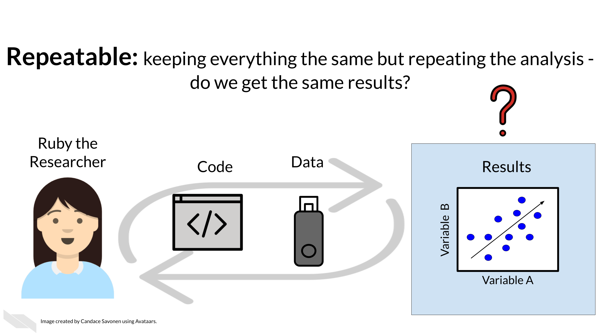
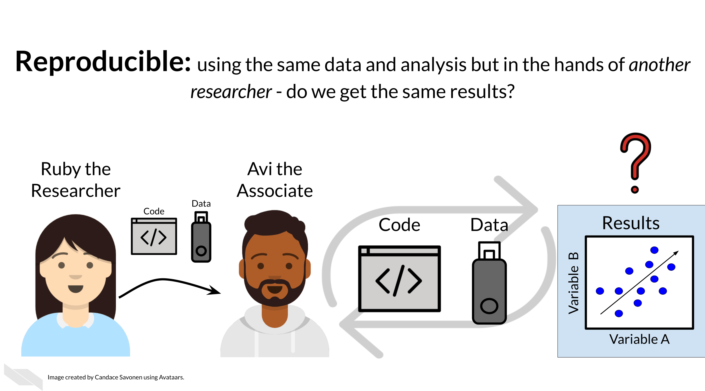
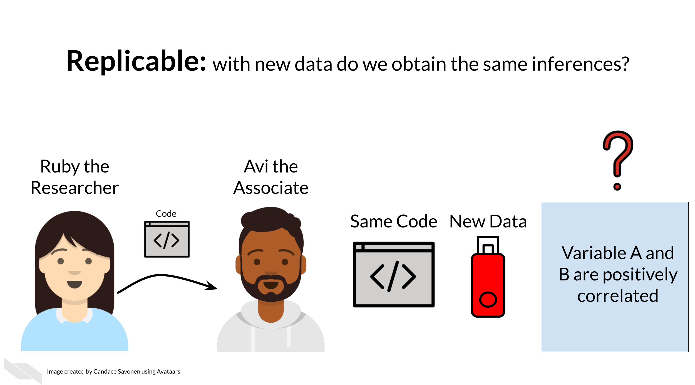
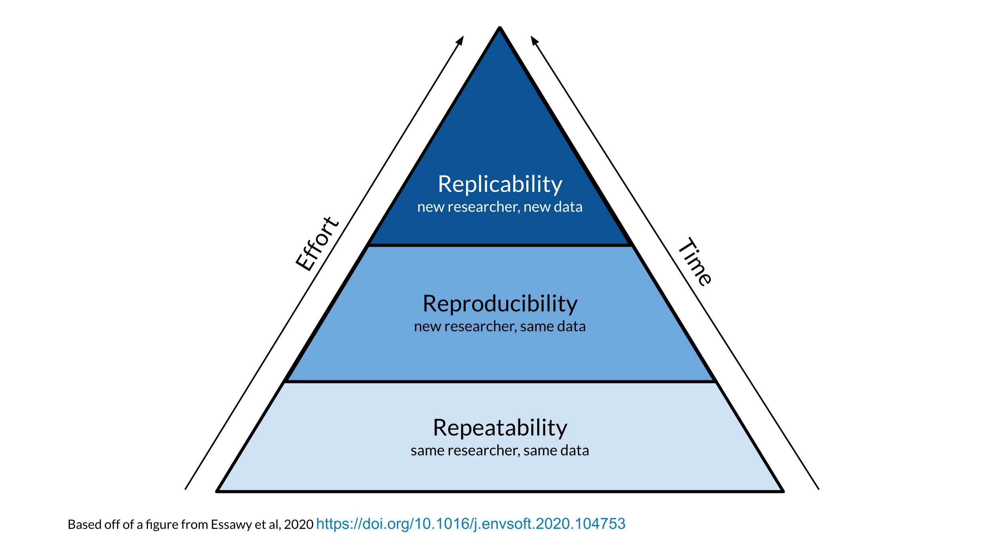
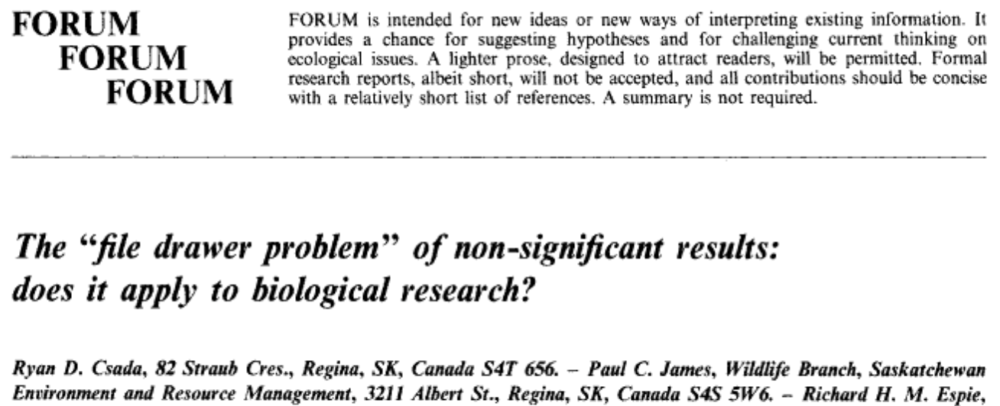
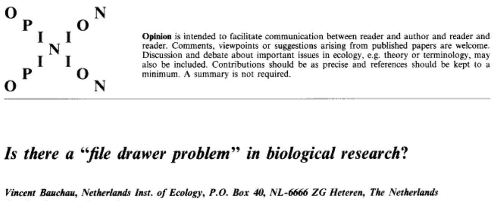
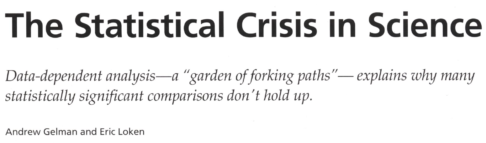
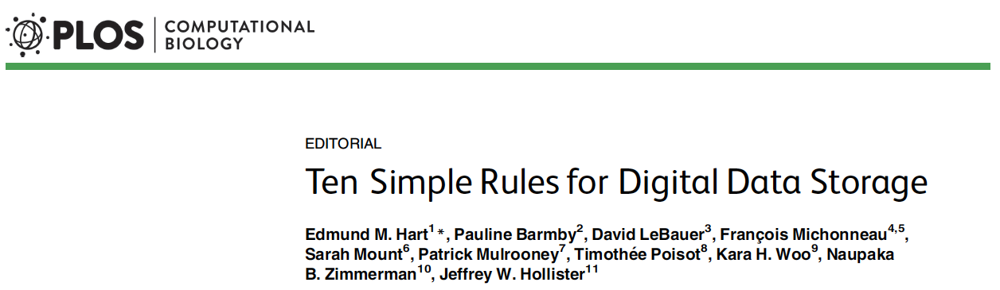
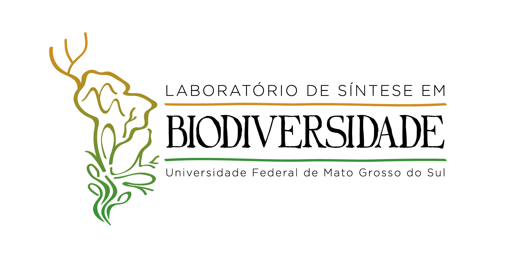

## Roteiro

::: {.incremental}
- Por que reprodutibilidade é o cerne da ciência
- Como uma análise honesta sai do trilho
- O que fazer com os dados e com o código
- Programação literária: Markdown, knitr e Quarto
:::

# Por que isso importa

## A pergunta {.smaller}

::: {.r-fit-text}
Se eu repetir o seu experimento
:::

::: {.r-fit-text}
exatamente como você descreveu,
:::

::: {.r-fit-text}
chegarei aos mesmos resultados?
:::

## Três motivos {.smaller}

::: {.incremental}
- **É o cerne da ciência.** Tudo o que fazemos deve poder ser reproduzido —
  e assim confirmado. Ou não.
- **O seu eu de seis meses atrás não responde e-mail.** Metade do trabalho
  de tornar algo reprodutível é para você mesmo.
- **Trabalho transparente é mais lido e mais citado.** Reprodutibilidade
  também é estratégia de impacto.
:::

## O alerta que abriu a discussão

::: {.citacao}
Ioannidis, J.P.A. (2005). **Why Most Published Research Findings Are False.**
*PLoS Medicine* 2(8): e124.
[doi:10.1371/journal.pmed.0020124](https://doi.org/10.1371/journal.pmed.0020124)
:::

> "Simulations show that for most study designs and settings, it is more
> likely for a research claim to be false than true."

. . .

O argumento não é sobre fraude. É sobre **poder estatístico, viés e o número
de hipóteses testadas** num campo.

## E o que os pesquisadores dizem

::: {.citacao}
Baker, M. (2016). **1,500 scientists lift the lid on reproducibility.**
*Nature* 533: 452–454.
[doi:10.1038/533452a](https://doi.org/10.1038/533452a)
:::

::: {.incremental}
- **70%** dos pesquisadores tentaram e **falharam** em reproduzir o
  experimento de outro cientista
- Mais da metade falhou em reproduzir **o próprio** experimento
:::

# Os conceitos

## Repetível {.smaller}

Mesma pessoa, mesmo código, mesmos dados, mesma máquina.

{.nostretch width="90%"}

## Reprodutível {.smaller}

**Outra** pessoa, mesmo código, mesmos dados.

{.nostretch width="90%"}

## Replicável {.smaller}

Outra pessoa, mesmo método, **dados novos** — as conclusões se sustentam?

{.nostretch width="90%"}

## Quanto custa cada degrau {.smaller}

{.nostretch width="78%"}

::: {.citacao}
Ilustrações de Candace Savonen —
[Advanced Reproducibility in Cancer Informatics](https://jhudatascience.org/Adv_Reproducibility_in_Cancer_Informatics/defining-reproducibility.html),
JHU Data Science Lab · **CC BY 4.0**. A pirâmide é baseada em figura de
Essawy et al. (2020), [doi:10.1016/j.envsoft.2020.104753](https://doi.org/10.1016/j.envsoft.2020.104753)
:::

## Quatro palavras que não são sinônimas {.smaller}

Resumindo o que acabamos de ver:

| Termo | Dados | Método | Pergunta |
|---|---|---|---|
| **Repetível** | os mesmos | o mesmo | mesma pessoa repete |
| **Reprodutível** | os mesmos | o mesmo | **outra** pessoa repete |
| **Replicável** | **novos** | o mesmo | o resultado se sustenta? |
| **Generalizável** | novos | novo contexto | vale além daqui? |

. . .

::: {.citacao}
Adaptado de
[Advanced Reproducibility in Cancer Informatics](https://jhudatascience.org/Adv_Reproducibility_in_Cancer_Informatics/defining-reproducibility.html),
JHU Data Science Lab · CC BY
:::

## As duas que mais confundem {.smaller}

::: {.incremental}
- **Reprodutibilidade** — mesmos dados + mesmo código = mesmos resultados.
  É um problema **técnico**. Está inteiramente nas suas mãos.
- **Replicabilidade** — novos dados + mesmo método = mesmos resultados.
  É um problema **científico**. Não está nas suas mãos.
:::

. . .

::: {.citacao}
Esta aula trata da primeira. Sem ela, a segunda nem chega a ser testável.
:::

# Como a análise sai do trilho

## Más condutas em publicação {.smaller}

::: {.incremental}
- **HARKing** — *Hypothesizing After the Results are Known*: apresentar como
  hipótese a priori o que só apareceu depois
- **P-hacking** — testar muitas variáveis e reportar só a que "deu
  significante"
- **File drawer** — o que não deu significativo fica na gaveta
- **Reporte seletivo** — de dados, modelos, procedimentos de tratamento
- **Manipulação, fabricação e seleção** de dados
:::

. . .

::: {.citacao}
Só a última é fraude. As outras quatro a gente comete **sem perceber**.
:::

## O problema do valor de p {.smaller}

::: {.incremental}
- O valor-p mede a **incompatibilidade dos dados com a hipótese nula** —
  não a probabilidade de a hipótese ser verdadeira
- `p < 0,05` não é selo de verdade
- Reporte **tamanho de efeito** e **tamanho amostral** (graus de liberdade),
  sempre
:::

## A declaração da ASA

::: {.citacao}
Wasserstein, R.L. & Lazar, N.A. (2016). **The ASA Statement on p-Values:
Context, Process, and Purpose.** *The American Statistician* 70(2): 129–133.
[doi:10.1080/00031305.2016.1154108](https://doi.org/10.1080/00031305.2016.1154108)
:::

::: {.incremental}
- Valores-p não medem a probabilidade de a hipótese ser verdadeira, nem a de
  os dados terem surgido por acaso
- Conclusões científicas não devem se basear apenas em o p ultrapassar um limiar
- Por si só, o p não é boa medida de evidência sobre um modelo
- Inferência adequada exige **relato completo e transparência**
:::

## O debate já era velho na ecologia

{width=48%}
{width=48%}

::: {.citacao}
Csada, R.D.; James, P.C.; Espie, R.H.M. (1996). **The "file drawer problem"
of non-significant results: does it apply to biological research?**
*Oikos* 76: 591–593.
[doi:10.2307/3546355](https://doi.org/10.2307/3546355)
:::

::: {.citacao}
Bauchau, V. (1997). **Is there a "file drawer problem" in biological
research?** *Oikos* 79: 407–409.
[doi:10.2307/3546025](https://doi.org/10.2307/3546025) — a réplica, no ano seguinte.
:::

## Graus de liberdade do pesquisador {.smaller}

Remover este *outlier*? Transformar em log? Juntar estas duas categorias?
Excluir a coleta da chuva?

. . .

Cada decisão dessas é defensável **sozinha**. Tomadas todas juntas, olhando
para o resultado, elas produzem qualquer coisa que você queira.

{width=75%}

::: {.citacao}
Gelman, A. & Loken, E. (2014). *American Scientist* 102(6).
Não é preciso haver má-fé: basta que as escolhas dependam dos dados.
:::

# O que fazer

## O seu melhor colaborador

> "Your best collaborator is yourself six months from now —
> and your past self doesn't answer emails."

. . .

Tudo o que vem a seguir tem esse teste único: **daqui a seis meses, você
consegue rodar isto de novo e chegar ao mesmo número?**

## Ética e transparência {.smaller}

::: {.incremental}
- **Dados abertos** — depositar em repositório: Dryad, Figshare, Zenodo
- **Código aberto** — disponibilizar o script da análise
- **Reportar incerteza** — intervalos de confiança, não só valores-p
- **Não dicotomizar** — evitar "o efeito existe" com p = 0,049 e
  "não existe" com p = 0,051
:::

## Dez regras simples



::: {.citacao}
Hart, E.M.; Barmby, P.; LeBauer, D.; Michonneau, F.; Mount, S.; Mulrooney, P.;
Poisot, T.; Woo, K.H.; Zimmerman, N.B.; Hollister, J.W. (2016).
**Ten Simple Rules for Digital Data Storage.**
*PLOS Computational Biology* 12(10): e1005097.
[doi:10.1371/journal.pcbi.1005097](https://doi.org/10.1371/journal.pcbi.1005097)
:::

## Regra 3 — deixe os dados brutos, brutos {.smaller}

O arquivo que saiu do equipamento ou do caderno de campo **nunca é editado**.

::: {.incremental}
- Toda limpeza acontece em script, gerando um arquivo **novo**
- `dados/brutos/` é somente leitura — lembram da aula 02?
- Se você sobrescreveu o bruto, não há como voltar
:::

## Regra 4 — formatos abertos {.smaller}

`.csv`, `.txt`, `.tsv` — não `.xlsx`, não `.sav`, não `.mdb`.

. . .

::: {.citacao}
Vai que a empresa dona do formato vai à falência. Ou muda o formato.
Ou você simplesmente não tem mais a licença.
:::

## Regra 5 — dados tratados para análise {.smaller}

E "tratado para análise" tem um nome, que vocês já conhecem: **tidy data**.

| Untidy | | | Tidy | | |
|---|---|---|---|---|---|
| `sitio` | `2019` | `2020` | `sitio` | `ano` | `abund` |
| brejo | 12 | 15 | brejo | 2019 | 12 |
| mata | 8 | 11 | brejo | 2020 | 15 |
| | | | mata | 2019 | 8 |
| | | | mata | 2020 | 11 |

. . .

À esquerda, `2019` e `2020` **são valores**, não nomes de variáveis.
À direita, cada linha é uma observação.

::: {.citacao}
O exemplo completo está na **Figura 1** de Hart et al. (2016) —
[ver figura](https://journals.plos.org/ploscompbiol/article/figures?id=10.1371/journal.pcbi.1005097) ·
PLOS Comp Biol · CC BY
:::

# Programação literária

## O problema do clique {.smaller}

Análises feitas clicando em menus — Excel, SPSS, Statistica — são
**impossíveis de auditar**.

. . .

::: {.r-fit-text}
"Em que ordem você clicou?"
:::

. . .

::: {.citacao}
Não existe resposta. E não existe como refazer no ano que vem.
:::

## A solução: o script é a receita {.smaller}

::: {.incremental}
- O código **é** a documentação do que foi feito, na ordem em que foi feito
- **Texto, código e resultados no mesmo documento**
- Se os dados mudam, o relatório se atualiza sozinho
:::

. . .

::: {.citacao}
Ferramentas: **R Markdown** e **Quarto** no R · **Pluto.jl** em Julia ·
**Jupyter** em Python
:::

## O ecossistema {.smaller}

```{dot}
//| echo: false
//| fig-width: 11
digraph ecossistema {
  rankdir=LR; bgcolor="transparent"; ranksep=0.7; nodesep=0.25;
  node [shape=box style="rounded,filled" fillcolor="#f3eee3" color="#1c6e8c"
        fontname="Helvetica" fontsize=22 margin="0.24,0.14"];
  edge [color="#8a8375"];

  QMD  [label="um arquivo .qmd\ntexto + código" shape=ellipse fillcolor="#e3dccd"];
  Q    [label="Quarto e knitr"];
  DOC  [label="Documentos\nHTML, PDF, Word"];
  SLD  [label="Apresentações\nrevealjs, Beamer, PowerPoint"];
  SITE [label="Sites e livros"];
  DASH [label="Dashboards"];

  QMD -> Q; Q -> DOC; Q -> SLD; Q -> SITE; Q -> DASH;
}
```

::: {.citacao}
O Quarto sucede o R Markdown e absorve o que antes eram pacotes separados —
`bookdown`, `blogdown`, `xaringan`. **Estes slides são um `.qmd`.**
:::

## Anatomia de um `.qmd` {.smaller}

**1. O cabeçalho YAML** — entre `---`, diz o que o documento é

**2. O texto** — Markdown puro: `**negrito**`, `*itálico*`, `# títulos`

**3. Os blocos de código** — abertos com três crases e `{r}`

. . .

O knitr executa cada bloco, captura a saída — números, tabelas, gráficos —
e costura tudo no documento final.

::: {.citacao}
É por isso que "atualizar a figura 3" deixa de ser uma tarefa.
:::

## Opções de bloco

Escritas dentro do bloco, começando com `#|`:

| Opção | O que faz |
|---|---|
| `echo: false` | roda, mas não mostra o código |
| `eval: false` | mostra o código, mas não roda |
| `warning: false` | esconde os avisos |
| `message: false` | esconde as mensagens de pacote |
| `fig-cap:` | põe legenda na figura |
| `cache: true` | não recalcula o que não mudou |

## O preço de esconder o aviso {.smaller}

`warning: false` e `message: false` no `_quarto.yml` são convenientes — e
foram o que fez esta figura sumir **sem erro, sem aviso, sem rastro**:

```r
#| fig-height: 4.4
plot(check_model(m))      # o bloco roda. A figura não aparece.
```

. . .

::: {.incremental}
- Primeiro diagnóstico: "`check_model()` devolve o objeto invisivelmente".
  Plausível, e **errado**
- Medindo o PNG em bytes, quatro formas de chamada × quatro alturas:
  **todo sucesso teve `fig-height` ≥ 5; toda falha, ≤ 4,4**
- Os seis painéis não cabem num dispositivo menor, o `grid` desiste e o
  `knitr` descarta a figura calado
:::

## O que fica disso {.smaller}

::: {.incremental}
1. **`fig-height: 5.2`** ou mais para o `check_model()`. Ponha o porquê em
   comentário, ou alguém vai "limpar" isso daqui a seis meses
2. Uma hipótese plausível **medida** vale mais que uma hipótese plausível
   defendida. A primeira explicação estava boa demais para ser checada — e
   estava errada
3. `warning: false` não conserta o aviso: ele tira a sua chance de ler o
   aviso. Ligue os avisos quando algo não sair como esperado
:::

. . .

::: {.citacao}
Episódio real, do repositório de *Análise de Dados Univariados* (setembro de
2026). O script que mediu isso ficou versionado junto, em `R/`, para que a
conclusão pudesse ser refeita — que é do que esta aula inteira trata.
:::

## Como tornar o código reprodutível {.smaller}

::: {.incremental}
- **1ª regra: comente.** Diga *por que*, não *o quê*
- Dê nomes que façam sentido aos objetos
- Adira a um guia de estilo — qualquer um
- **Teste antes de distribuir**: rode em sessão limpa, do zero
- Publique em repositório público
- Evite espalhar uma mesma análise por vários scripts soltos
:::

## Um exemplo de verdade

Código real, de um projeto deste laboratório. Ele remove três linhas antes
de padronizar as variáveis:

```r
n.datos_pad <- decostand(n.datos[-c(152, 164, 107), c(3, 4)],
                         method = "standardize")
```

. . .

Funciona. As linhas 107, 152 e 164 são exatamente as três que têm `NA` em
`LHC` — eu conferi.

## Mas… {.smaller}

::: {.incremental}
- O número **152** não diz nada sobre *por que* aquela linha sai
- Insira uma observação no meio do arquivo e os três índices passam a
  apontar para linhas **erradas** — sem erro, sem aviso
- Seis meses depois, nem o autor sabe mais o que eram
:::

. . .

```r
n.datos_pad <- decostand(na.omit(n.datos[, c(3, 4)]),
                         method = "standardize")
```

::: {.citacao}
Mesma saída hoje. A diferença é que esta versão continua certa amanhã —
e diz em voz alta o que está fazendo.
:::

## Check-list antes de submeter {.smaller}

::: {.incremental}
- Fiz o **desenho experimental antes** de coletar os dados?
- Reportei **todos** os testes que fiz, ou só os que deram certo?
- Meu código roda **no computador do colega**?
- Estou confundindo **significância estatística** com **relevância
  biológica**?
:::

# Exercícios

## Exercício 1 — o trabalho final {.smaller}

Abram o [`relatorio-modelo.qmd`](../aula-08-markdown-quarto/relatorio-modelo.qmd).
Ele já compila. **Troquem a pergunta.**

::: {.incremental}
- escolham outra resposta: `ewl`, `ctmin`, `amplitude` — ou outra preditora
- refaçam limpeza, figura, modelo e diagnóstico em volta dela
- o texto tem que mudar **sozinho**: nenhum número digitado à mão
:::

. . .

::: {.citacao}
O teste de aceitação: reinicie o R, apague o `.html` e o `_files`, renderize.
Compilou sem você tocar em nada? Está pronto.
:::

## Exercício 2 — o que mudou entre duas versões {.smaller}

Em `dados/historico/` há a planilha de trabalho que circulou **antes** da
publicação. O arquivo que usamos a semana toda é o publicado.

```{r}
#| eval: false
velho <- read.delim("dados/historico/anuros_altitude_versao-trabalho.txt")
novo  <- read.csv("dados/anuros_altitude.csv")
dim(velho); dim(novo)
```

. . .

::: {.callout-note icon=false}
## Descubram, com código, o que mudou

1. Quantos indivíduos estão nos dois arquivos? Só num deles?
2. Para os que estão nos dois: **alguma medida mudou de valor?**
3. Escrevam a resposta como um `.qmd` que compila
:::

## O que vocês vão encontrar {.smaller}

::: {.incremental}
- **219** indivíduos nos dois arquivos; **9** só na versão de trabalho
- **4 indivíduos com massa corporal diferente** entre as versões —
  um deles, `RPB 166`, de 2,73 g para 1,75 g
- a espécie mudou de nome: `Hypsiboas_faber` virou `Boana faber`
:::

. . .

::: {.citacao}
Nada disso está anunciado em lugar nenhum. Só aparece porque alguém comparou.
:::

## O que fazer com isso {.smaller}

Revisar dado de campo é **normal**: a balança é reconferida, um indivíduo sai
por um motivo que está no caderno, um código é reconciliado.

. . .

::: {.incremental}
- O problema não é revisar — é revisar **sem deixar rastro**
- Com os dois arquivos versionados, `git log` responderia em um comando o que
  aqui exigiu um script
- E uma análise feita sobre a versão antiga daria outro número, sem que
  ninguém percebesse
:::

. . .

::: {.citacao}
Olhem o `ID` da última linha do arquivo publicado:
`sem RPB C38 (tvz RPB 226)`. Um "talvez" que atravessou a revisão por pares
e está num repositório público até hoje. **Não é deboche** — é o que
acontece com todo mundo que não versiona o dado desde o primeiro dia.
:::

## Exercício 3 — usando um LLM {.smaller}

Peçam a um modelo de linguagem:

> "Crie um template de Quarto que inclua uma seção de importação de dados,
> uma análise exploratória com gráficos e uma tabela formatada com os
> resultados de um modelo linear."

. . .

Depois: **rodem**. O que quebrou? O que ele inventou?

::: {.citacao}
O LLM acelera o andaime. Conferir continua sendo trabalho seu.
:::

## E fim de papo! {.fim .smaller}



**Obrigado!** E por favor respondam o feedback — é importante.

[diogo.provete@ufms.br](mailto:diogo.provete@ufms.br) ·
[provetelab.org](https://provetelab.org/)

Setor de Ecologia — INBIO · UFMS
